# Azure VM Vulnerability Scan (With Nessus Pro)


---

### Lab Summary
Given my lack of experience in vulnerability scanning, I decided to boot up a VM and figure out what it's all about. Thanks to those free student credits, I fired up an Azure VM to run vulnerability scans on, and attempt to imitate a real world workflow of flagging, prioritizing, remediating, and re-scanning. 

In this lab we are using a ***Microsoft Windows Server 2019 (Datacenter)***, and using ***Nessus Professional*** to run unauthenticated scans on it. I chose the 2019 server version as it was likely to have more vulnerabilities out-of-the-box, giving me an easier time identifying and choosing one to remedy.

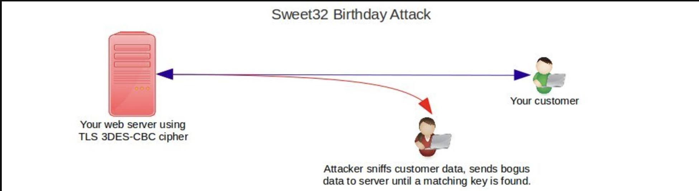

The vulnerability I fixed in this lab is SWEET32, which targets older SSL/TLS connections using 64-bit block ciphers which are not colliison-resistant. Using Nessus Professional, I identified the High priority vulnerability on the port 3389. This port, used for RDP connections, is extremely sensitive as user information is often exchanged via RDP connections to control other machines.

Using Schannel, I was able to create a registry key and explicitly disable 3DES (the cipher causing SWEET32) and rescan the machine to confirm the vulnerability patch.

The goal of this lab was to ultimately understanding the basics of vulnerability scanning and how professionals do it in the real world, and hence I chose to use Nessus Professional instead of free versions like OpenVAS or Nessus Essential. Unfortunately, this being my first lab, I was likely unable to explore the full range of benefits provided by Nessus Professional, or use other tools like nmap which is regrettable, but a good lesson in hindsight.

With all that said, let's begin with the lab!

---

### Setup and Configuration
Let's start with the easiest part, creating our scan. Now we could use a Basic Network scan, but it's common practice to use the Advanced scan, even if all the settings are the same. It simply allows us to upgrade the scan later on if we need. 

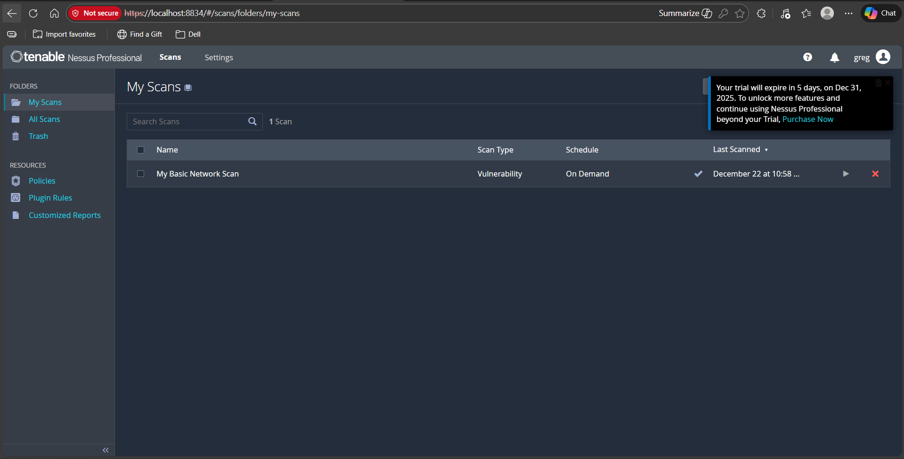

```
Note that while the name of the scan contains "Basic", it's actually still an Advanced Network scan. Not a huge difference here but just to avoid confusion with the earlier paragraph.
```

One thing to note about this lab is that we're using an ***unauthenticated*** scan. The difference between an authenticated and unauthenticated scan can be thought of as perspectives. We're trying to ascertain what an attacker would see with unauthenticated scans, hence much of the internals like registry values and patch compliance is ignored (since the scan can't log in to the VM).

In an authenticated scan, our goal is to find vulnerabilities in a system once access is granted. While not covered in this lab, it's crucial for compliance checks and OS hardening, areas I hope to explore in the future. Anyways, with the scan done, let's move on to our VM setup.

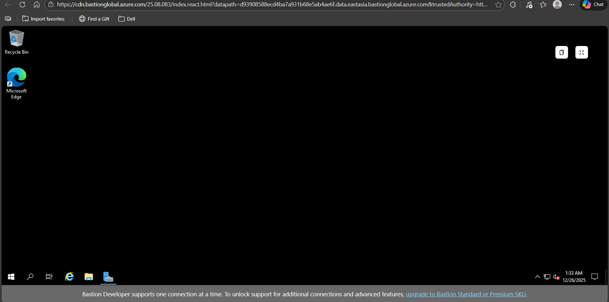

The Azure VM setup was pretty simple, just following the steps given on the website. One thing to note is that I'm using the Windows 10 2019 Datacenter image. I chose this specifically as I wanted something recent enough to be relevant, but not too new where very few vulnerabilities would be detected.

Now that we've setup and configured everything, let's start scanning.

---

### Initial Scan and Detections

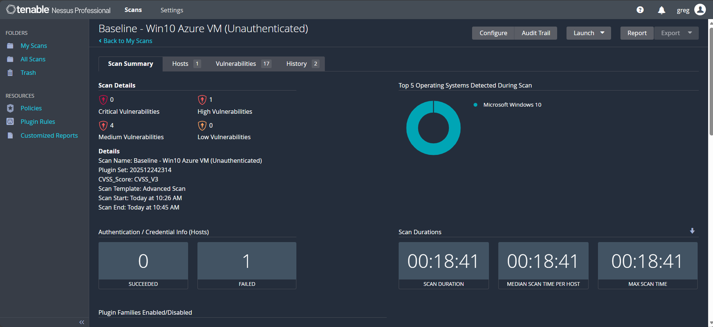

As we can see above, the Nessus scan took about 18 minutes to complete and detected a few High-Medium vulnerabilities.
Note that it says 1 Failed 0 Succeeded for authentication, which makes sense since it's an unauthenticated scan we're running.

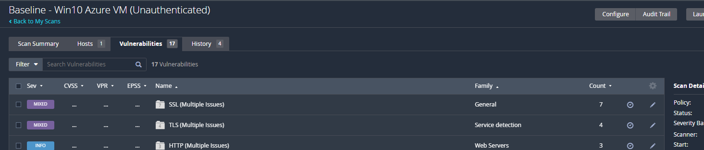

Taking a look at the vulnerabilities, one thing to note about Nessus scans is that they group them for management and decision making. As expected, we see two Mixed groupings for SSL and TLS, caused by setting up the webserver and hence exposing these services to attackers..

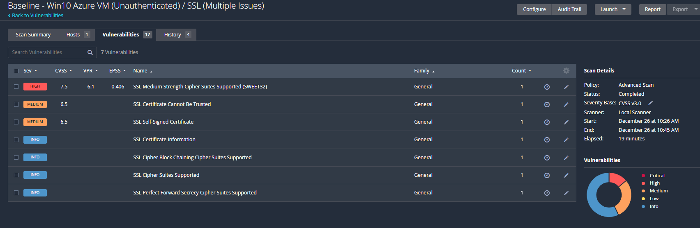

We can see that a bunch of vulnerabilities of different levels have been grouped here, all related to SSL. This is where a tool like Nessus differs from nmap. Nmap identifies vulnerabilities of the device, whereas Nessus is smarter and tries to group them to predict how attackers might use these to carry out an attack.

The goal of this lab is to focus on patching just one vulnerability, going through the vulnerability management workflow. As any cybersecurity analyst might, I chose to focus on the High vulnerability first.

---

### 3DES & SWEET32 Vulnerability

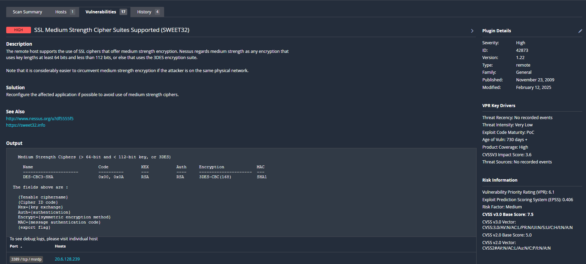

Now we get into the main vulnerability of this lab, ***SWEET32***. The SWEET32 vulnerability refers to possible block cipher collisions on a 64-bit cipher. In this case, our scan tells us it's likely 3DES being used, which is an issue because it uses 64-bit ciphers, instead of safe 128 bit ones.

Taking a look at the output section, we see some crucial information (although a bit cryptic at first). Let's look at some of the key takeaways from it.

- The first line on medium strength ciphers gives us a key range, but our focus is on 3DES. Even though it uses 168 bit keys, its vulnerability lies in block cipher collisions.
- KEX or Key exchange used here is RSA. This is another issue given it does not provide forward secrecy for sessions. However, it's not our main vulnerability here.
- SHA1 which is deprecated is used. Another additional issue, but not our main concern here.

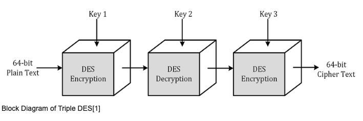

Our main vulnerability is 3DES having only 64 bit blocks, allowing for birthday attacks. An interesting thing to note here is the lack of ports highlighted. For this lab, I tried to configure IIS (Internet Information Services) which is a general purpose web-server that runs on Windows. 

The reason for running it was to expose the 443 ports (since HTTPS would be used), and hence allow the SSl vulnerability to be detected easily. Clearly the configuration didn't work properly, but luckily the vulnerability was still detected thanks to it's exposure on port ***3389***.

This is the RDP (Remote Desktop Protocol) port, which allows users to remotely control other windows machines. I used RDP in fact, to control the Azure VM on my desktop.

This is a key learning opportunity, as it shows that TLS/SSL connections are not limited to the web, but can also prop up in RDP connections. So even if a machine isn't intended to be exposed to the internet, these vulnerabilities should still be ironed out.

Now that we're all caught up on SWEET32, let's see how to mitigate it.

---

### Remedy & Rescanning

To remedy this vulnerability, we need to ensure that 3DES is disabled for any TLS/SSL interactions that our machine engages in. Doing some research, I discovered the `Schannel` tool on windows that allows us to do just that.

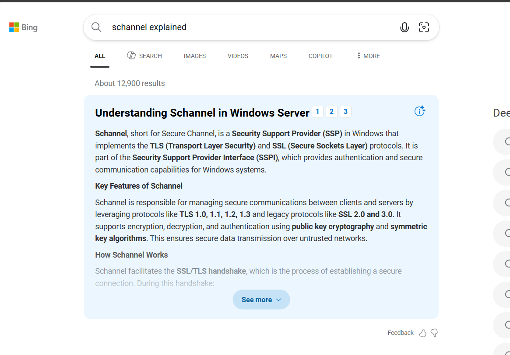

With a little help from ChatGPT, I understood that Schannel allows us to edit the registry to edit TLS configurations. A quick search gave the me the exact path I needed in the registry to make these changes.

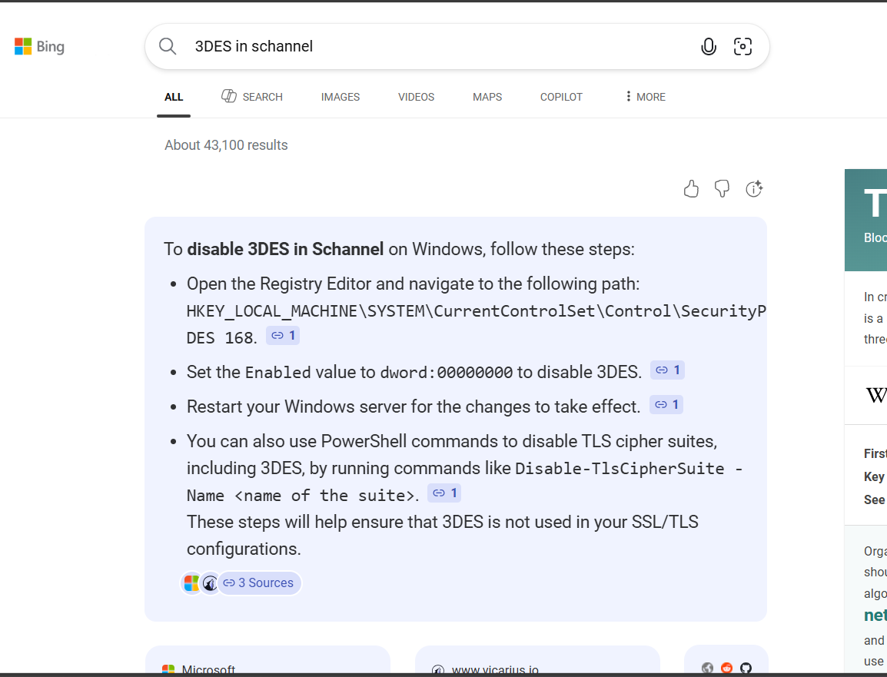

Now with the path `HKEY_LOCAL_MACHINE\SYSTEM\CurrentControlSet\Control\SecurityProviders\SCHANNEL\Ciphers\` we can check out the current configuration of 3DES.

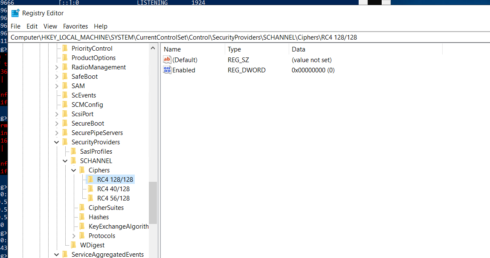

A bit puzzling initially, there's no configuration for 3DES under ciphers. However, this itself is the vulnerability, as no configuration allows the machine to assume it's allowed. While not common, it could be used in some communications, hence allowing attackers an opening.

To remedy it, all we need to do is add the Triple DES (3DES) cipher, and set it to disabled. This explicitly tells our machine to not use 3DES.

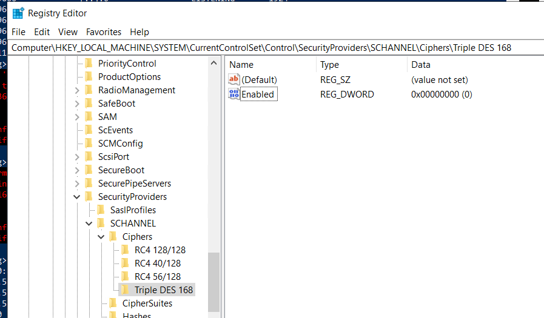

Now we've remediated the vulnerability, but we still need to rescan it on Nessus. While we know it's fixed, rescanning is part of the management workflow to ensure 100% it's fixed, and that nothing else broke or got exposed due to our fix.

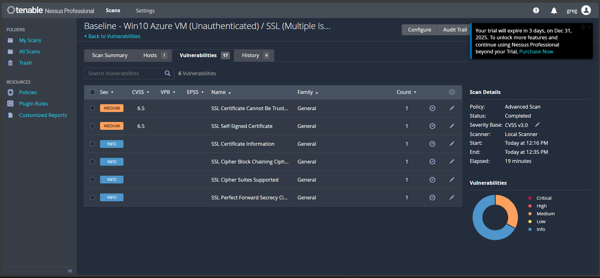

And voila! Under SSL vulnerabilities on the rescan, our High SWEET32 issue is gone now. We've successfully identified a vulnerability in our Azure VM, remedied it, and rescanned to ensure its been removed, successfully wrapping up this lab. Thanks for reading!


***Diagram to explain SWEET32 through RDP in TLS/SSL handshake, and then CVE/MITRE mapping***


