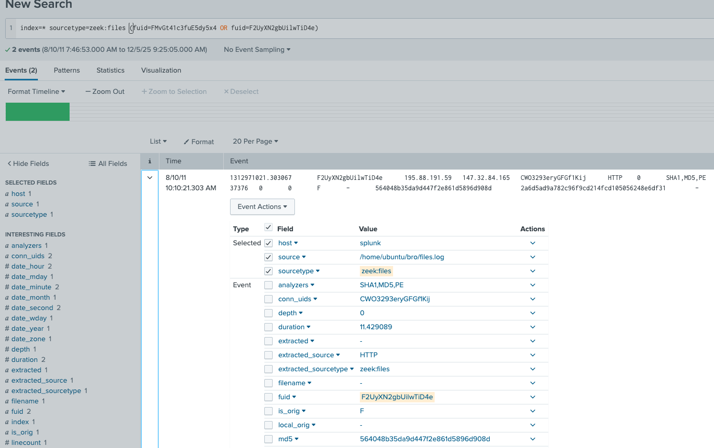
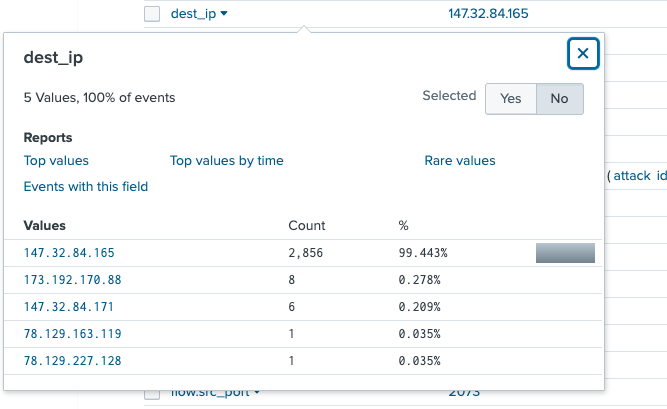
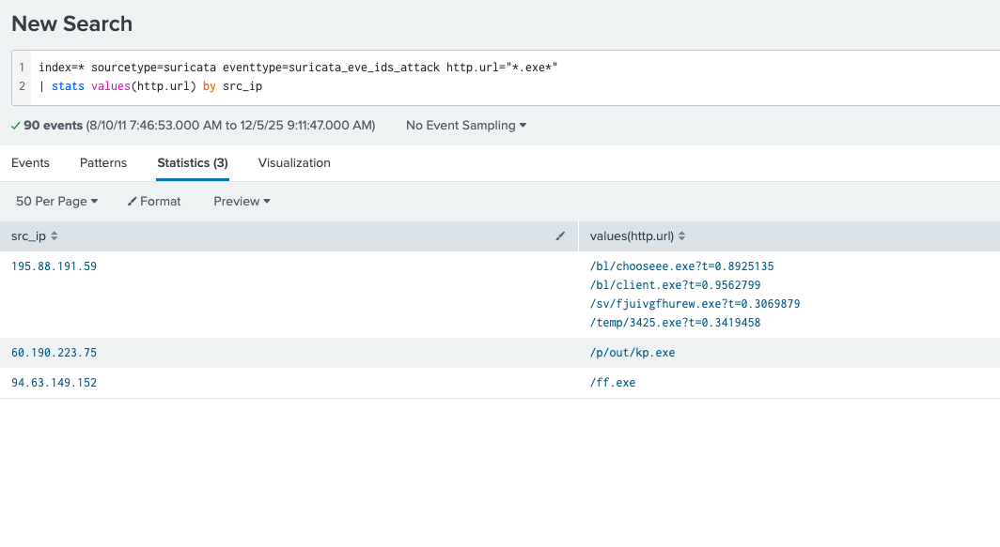

# NerisBot
### Introduction
This lab requires us to investigate suspicious activity on a university webserver and identify the Command and Control (C2) communications involved. We are expected to comb through suricata and zeek logs using the Splunk SIEM.

***Q1) During the investigation of network traffic, unusual patterns of activity were observed in Suricata logs, suggesting potential unauthorized access. One external IP address initiated access attempts and was later seen downloading a suspicious executable file. This activity strongly indicates the origin of the attack.
What is the IP address from which the initial unauthorized access originated?***

To solve this I first identified the fuids (file id's) of some of the executable files found in zeek:log. Using these fuids, I then searched the files log and found the suspicious IP to be ***195.88.191.59***.

***Q2) Investigating the attacker’s domain helps identify the infrastructure used for the attack, assess its connections to other threats, and take measures to mitigate future attacks. What is the domain name of the attacker server?***

To solve this I just looked through logs coming from this IP in zeek:log and found ***nocomcom.com*** under the http.hostname field. 

***Q3) Knowing the IP address of the targeted system helps focus remediation efforts and assess the extent of the compromise. What is the IP address of the system that was targeted in this breach?***

This one's rather easy, all we have to do is look for the most common IP.

I chose dest_ip here but it should work with src_ip too since most communications would still involve the host sending lots of packets to the attackers (or elsewhere). 

***Q4) Identify all the unique files downloaded to the compromised host. How many of these files could potentially be malicious?***

Admittedly this was a lot trickier than I had anticipated. I began by simply filtering for all files sent by the 195.88.191.59. Doing so, I found 4 distinct files and entered it, but it was wrong.

Unfortunately I was stuck for a while on this challenge and decided to take a look at the official writeup for help. I realized from a quick glance that exe files from other IPs had also been downloaded.

This was a good learning opportunity for me as I came across an instance where just solving a lab's narrow challenges can have implications on our investigations down the road. Had I paid more attention to the other IPs sending exe files, I could've solved this much earlier without help.

Moving on, out of the urls shown above, the one from 94.63.149.152 was benign, and two from 195.88.191.59 were duplicate md5 hashes. In the end, we had ***4*** malicious files downloaded.

***Q5) What is the SHA256 hash of the malicious file disguised as a .txt file?***

Though not shown from the image earlier, I tracked the kx4.txt file that was sent from 195.88.191.59 and found it's md5 hash to be 564048b35da9d447f2e861d5896d908d. 

Since the SHA256 field, though present, wasn't populated for any entries, I had to search up this hash on VirusTotal to get ***6fbc4d506f4d4e0a64ca09fd826408d3103c1a258c370553583a07a4cb9a6530***.

 

This lab was harder than I expected, mostly because I got stuck with having to track files back and forth. Though I've used zeek and suricata logs before, I got used to using zeek on the terminal and suricata on my own EFK (Filebeat instead of logstash) dashboard.

Though powerful, I found splunk a bit annoying to use given it's not technically a SIEM (though has all the tools needed). Regardless, I've identified that even though I have experience in SIEM's, a little more practice is needed to gain the mastery and be more efficient in my filtering and analysis.

