# REvil

### Introduction
In this lab we are working for a cybersecurity consulting firm (I wish!), investigating a ransomware attack on our client. This ransomware caused encryption of the client's employees' machines, leading to a changed desktop background and a ransom note appearing.

I did a little background research into REvil (since this lab is longer at 1hr15min, I assumed it would be harder) and found that it's a form or ***RaaS or Ransomware as a Service***. Few key points I noted were that REvil often attacked through ***Windows RDPs (Remote Desktop Servers)*** and could be administered through ***Exploit Kits*** (though phishing is also possible).

Finally, for this lab we have access to both Splunk and ELK VMs. Though I'm more comfortable with ELK, I though it'd use splunk since it aligns more with the industry standard.

----
 

***Q1) To begin your investigation, can you identify the filename of the note that the ransomware left behind?***

Searching online, I learned that ransomeware notes are often in the form of txt or html files. A quick search for `.txt` files tipped me off to the TargetFilename field in the windows logs.

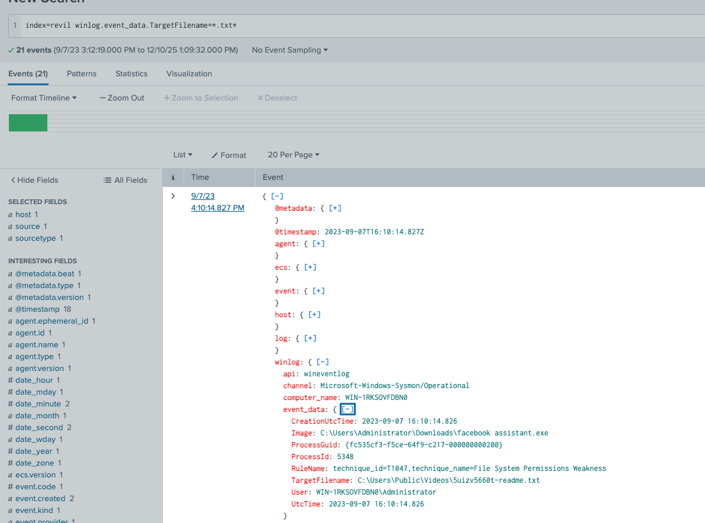

Just to double check, I tried listing down all `.txt` files using the command `index=revil winlog.event_data.TargetFilename=*.txt*` and confirmed that ***5uizv5660t-readme.txt*** was the only one, highly likely the ransomware note.

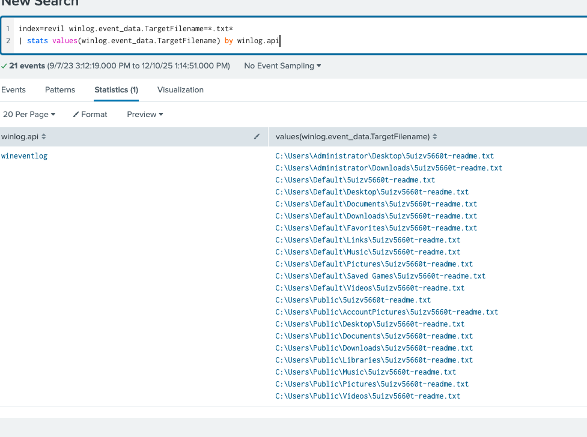

***Q2) After identifying the ransom note, the next step is to pinpoint the source. What's the process ID of the ransomware that's likely involved***

Initially I thought this was easy. I simply plugged in the PID I found in the log which was 6596. Obviosuly, this was wrong and I had to look deeper.

First off, I filtered for all `winlog.process.pid` values and found that everything was 6596. This set off alarm bells, and upon further investigation, I noticed the mixup I'd made.

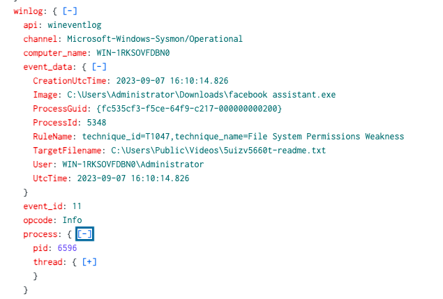

As shown above, there are two different process ids, the `winlog.process.pid` and `winlog.event_data.ProcessId`. The former is the id that created the Sysmon log and the latter is the actual process ID. Since all of these are sysmon logs, the `winlog.process.pid` is always 6596.

Anyways, even with this info I still needed to find the correct ProcessId. I noticed that the sysmon event code was 11, which logs when a new file is created (or existing one overwritten).

Filtering with the command `index=revil event.code=11
| stats values(winlog.event_data.ProcessId) by winlog.event_data.Image` I found the following Images (processes that spawned the README write process).

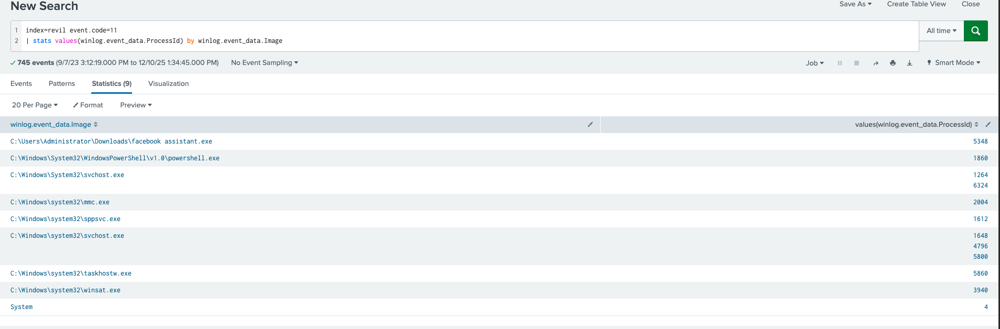

From the selection, we can see the odd one being facebook's assistant.exe, which shouldn't have anything to do with writing files. Hence, the answer here is it's process id, ***5348***.

***Q3) Having determined the ransomware's process ID, the next logical step is to locate its origin. Where can we find the ransomware's executable file?***

For this, we can just look at the image above for the corresponding path of the process, ***C:\Users\Administrator\Downloads\facebook assistant.exe***.

***Q4) Now that you've pinpointed the ransomware's executable location, let's dig deeper. It's a common tactic for ransomware to disrupt system recovery methods. Can you identify the command that was used for this purpose?***

Doing some research online, I found that tactics often include deleting the shadow copies and backups. This would likely be done using a powershell command, so I tried to filter `index=revil winlog.event_data.Image=*powershell* 
| stats values(winlog.event_data.CommandLine)` to see if anything came up.

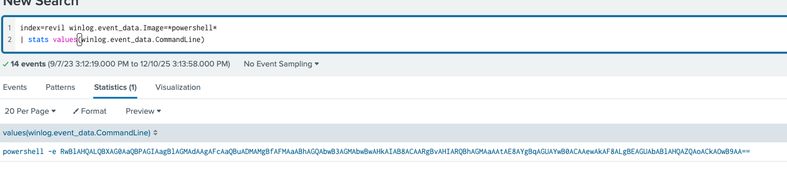

Now I thought the above command was gibberish and unrelated to my search (terrible conclusion). After another 20 minutes of searching and some prompting with ChatGPT, I realised it was the correct command - simply obfuscated.

Tossing it in Cyberchef, I easily decoded it from Base64 and got the command, ***Get-WmiObject Win32_Shadowcopy | ForEach-Object {$_.Delete();}***.

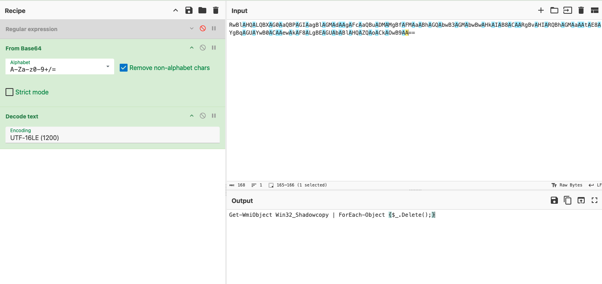

***Q5) As we trace the ransomware's steps, a deeper verification is needed. Can you provide the sha256 hash of the ransomware's executable to cross-check with known malicious signatures?***

First I thought this was just referring to the hash given for the powershell.exe entry.

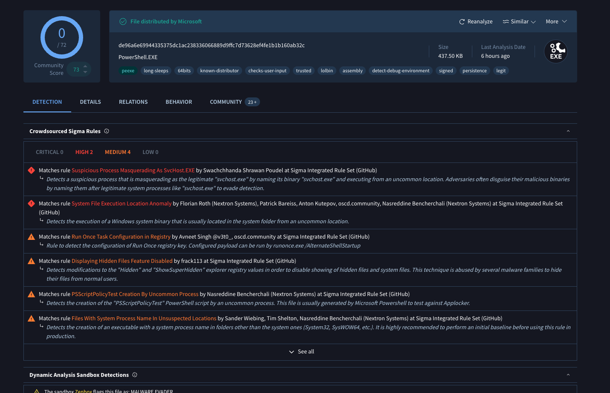

While it was flagged as suspicious, it's community score is still 0, which is a hint that it isn't the actual ransomware hash, just a product of the ransomware.

I instead went to look for any hashes corresponding to the facebook assistant entry using `index=revil winlog.event_data.Image=*facebook* 
| stats values(winlog.event_data.Hashes)` and found the actual hash.

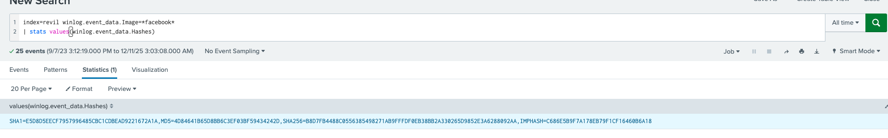

Now using this new sha256 hash, I did a quick VirusTotal search to confirm it.

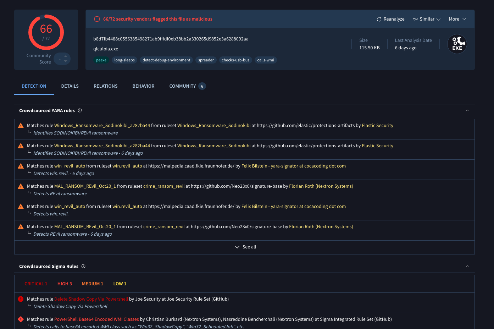

Other than the high community risk score, there's a few giveaways that this is the correct hash we're looking for. Firstly, the ransomware name comes up as ***Sodinokibi*** which from my research prior is another name for REvil (given it's Russian source).

Secondly, the line all the way below saying "Delete Shadow Copy via Powershell" corresponds to what this malware does, which is deleting any backups and covering it's tracks (using powershell as we already know).

Hence, the correct sha256 hash is ***b8d7fb4488c0556385498271ab9fffdf0eb38bb2a330265d9852e3a6288092aa***.

***Q6) One crucial piece remains: identifying the attacker's communication channel. Can you leverage threat intelligence and known Indicators of Compromise (IoCs) to pinpoint the ransomware author's onion domain?***

Now this was an interesting challenge. I tried looking for `.onion` domain endings in VirusTotal but nothing came up. Using a hint from the lab, I opened up Any.run which is an interactive malware analysis sandbox. Searching up the IOC (hash) we had, I found many entries of the malware and looked through a few. 

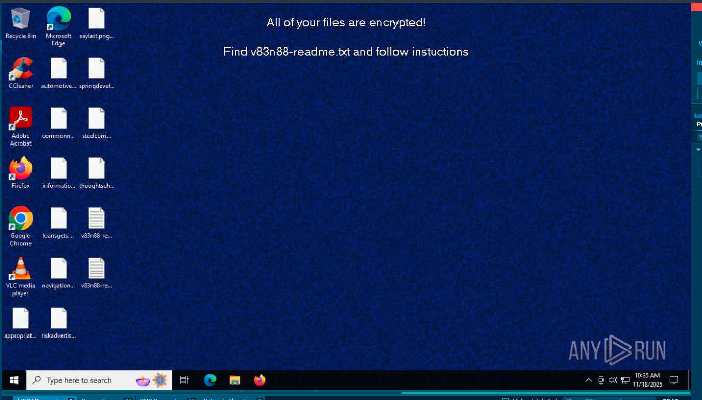

As shown in the example above, the ransomware indeed encrypted all the files (shown on desktop without their usual icons) and changed the background to the readme.txt with instructions. Looking at another example, I got a chance to see the actual readme from the ransomware.

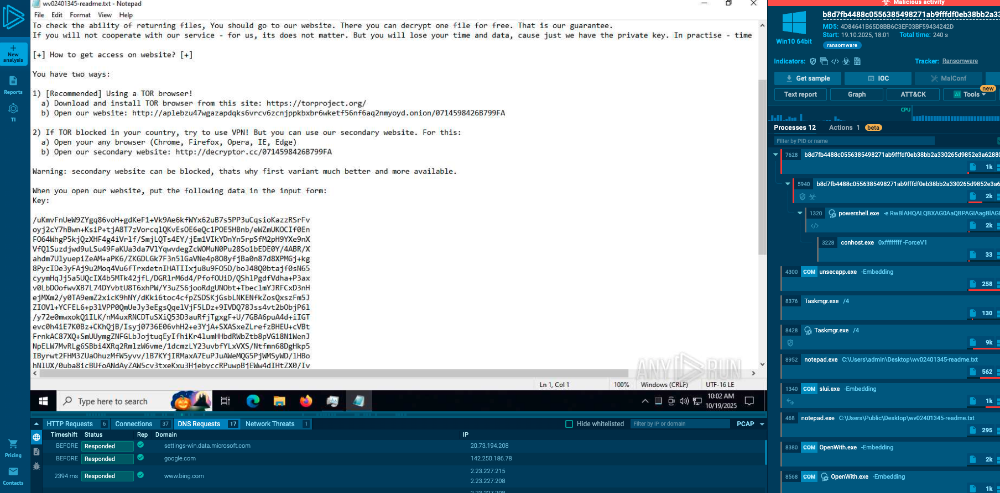

The readme conveniently gives us the `.onion` domain we were looking for, but also shows us some of the instructions the hackers gave the victims to retrieve their files. All in all, we've found the final piece of the puzzle, ***aplebzu47wgazapdqks6vrcv6zcnjppkbxbr6wketf56nf6aq2nmyoyd.onion***.

----
 

### Conclusion and Thoughts
This was a really fun lab as I got to dive into some Threat Hunting and working with cool ransomware (not for the victims ofcourse). I particularly enjoyed the final part where I got to try out Any.run and had the chance to see what the ransomware actually looks like.

Threat Hunting is a lot more enjoyable compared to simple Network Forensics where we don't really get to see the malware or anything in action. Also on a side note, looking through some of the examples, I was suprised to see how polite and helpful hackers are in providing victims with all the information needed to pay the ransom. Definitely my favorite lab to date!

