# RevengeHotels APT

<br>

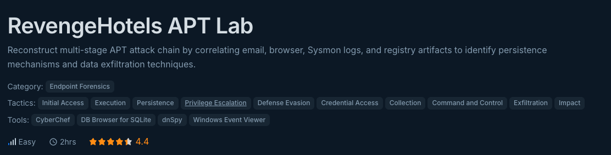

<br>

### Introduction
In this lab, an SOC team detected suspicious ***network activity*** from an ***administrator's*** workstation, including connections to an unknown external IP address and unauthorized ***security tool modifications***. The user opened a legitimate document sent via ***email*** which caused the ***security software*** to be disabled.

There's evidence on unusual ***file creation*** and ***system config changes***, as well as potential ***data exfiltration*** hours after compromise. We're given the full disk triage and need to complete the attack chain and determine the full scope of the multistage attack.

Now considering this is a longer lab with a hefty preamble, I decided to highlight some points I thought might be important/useful in bold. Note that not all of them are necessarily important to the lab, just some stuff I highlighted to begin with in case I get stuck anywhere.

---
<br>

***Q1) During the initial compromise, the threat actor distributed a phishing email containing a URL pointing to a malicious JavaScript file disguised as a legitimate document. What is the name of the JavaScript file downloaded from the phishing link?***

This is my first time working with an entire disk image so I was initially a bit overwhelmed with the information given. Unlike a pcap, we are given a whole array of tools and artifacts.

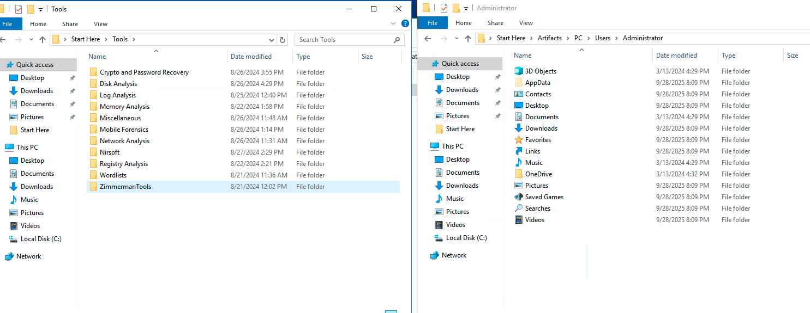

However, we can refer to the long info dump given for this challenge. First off, we know it's an administrator's account that was compromised. Hence, we can pick Administrator from the Users given to us. 

Next, we know that the document from the email caused a Javascript file to be downloaded to the host. With this info, we know we're looking for a `.js` file in the Downloads section. 

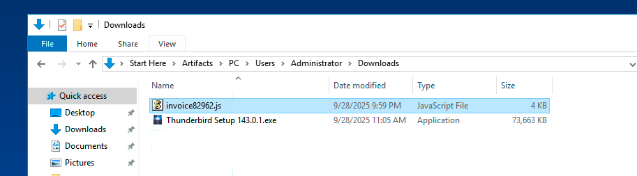

And there we go, our first answer, ***invoice82962.js***.

----
<br>

***Q2) The malicious JavaScript payload was hosted on a compromised website to facilitate the initial infection. What is the complete domain name that hosted the malicious JS file?***

To find domain names, I had to look into the browser data logs given under App Data. Unfortunately, I spent a lot of time combing through the Microsoft Edge logs (since it's a windows machine after all) and couldn't find anything.

Eventually, pivoting to Google Chrome logs using the file path `C:\Users\Administrator\Desktop\Start Here\Artifacts\PC\Users\Administrator\AppData\Local\Google\Chrome\User Data\Default` I was able to find a History file. Though not explicitly a dbsqlite file, I was able to open it in sqlite and look through the downloads section.

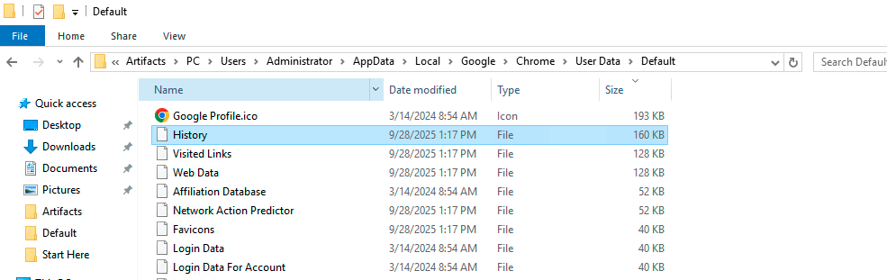

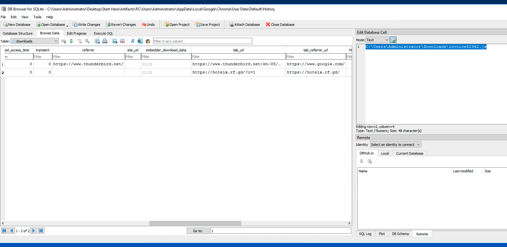

As shown above, looking at the downloads table, we can see that for the invoice js file, the associated domain name is ***hotelx.rf.gd***. We can confirm by looking in the donwload_url_chains which lists all urls from which downloads are made. 

```
The path \AppData\Local\Google\Chrome\User Data\Default is a common location for browser data logs. Think of it as a shortcut log to check when looking for browser data logs.
```
---
<br>

***Q3) The JavaScript file created a PowerShell script to advance the attack chain. What is the full directory path where the PowerShell script was created from the JS file?***

Here we need to find the directory path of the file created by the js file. Now running the js file itself would be unwise for any challenge in this exercise since it could corrupt our machine and we should ***NEVER*** run malware.

Instead, I opened the file in notepad, hence allowing myself to hamrmlessly analyze it for any clues.

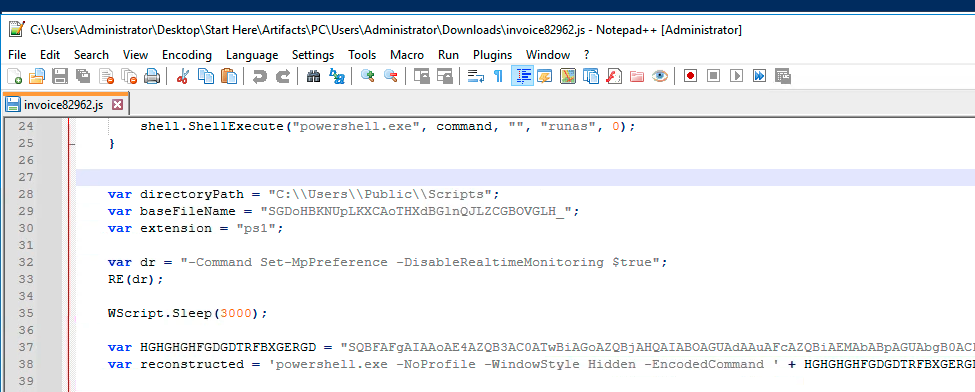

Conveniently for us, the directory path is available front and center, in plain text, and not obfuscated. Hence, we can note down the path to be ***C:\Users\Public\Scripts***.

---
<br>

***Q4) The PowerShell script invoked another PowerShell command to download two additional files onto the device and then executed one of them. What are the names of the downloaded files?***

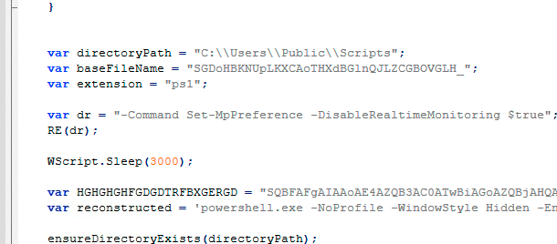

In the same invoice js file, we can see that another `.ps1` file is created and runs an obfuscated powershell command (refer to next picture). My first instinct was to decode this command and see if it revealed any files.

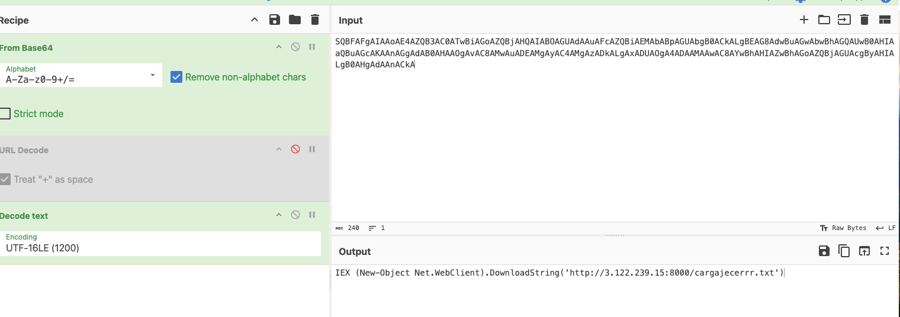

As shown above, the command downloads a file called cargajacerrr.txt. I noted this down to be the first of the 2 files. But I couldn't find any reference to a second file.

In event viewer, trying multiple IDs, I looked for any mention of this file name, but found none. Finally, reverting back to the original `.ps1` file, I tried to follow its logs and see what other files might've been downloaded.

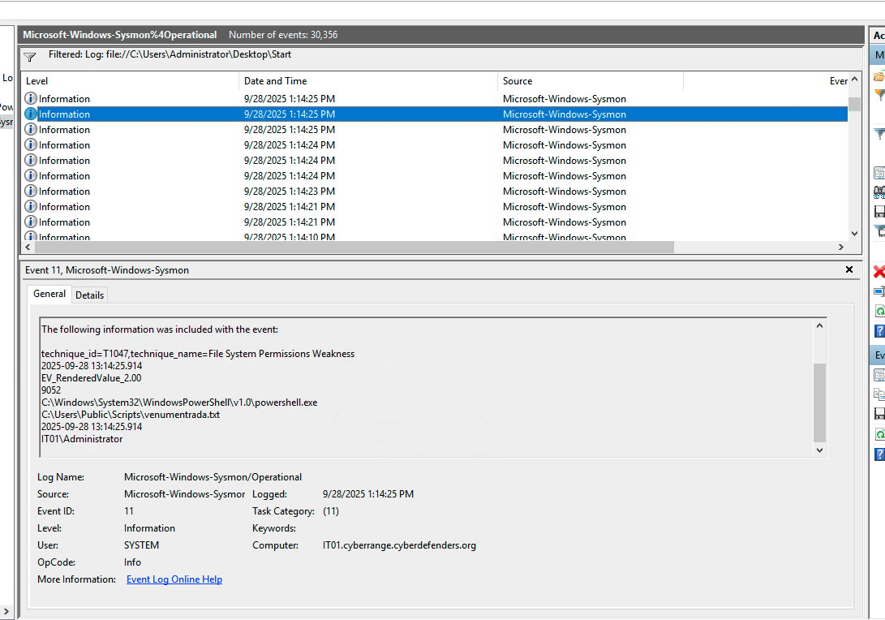
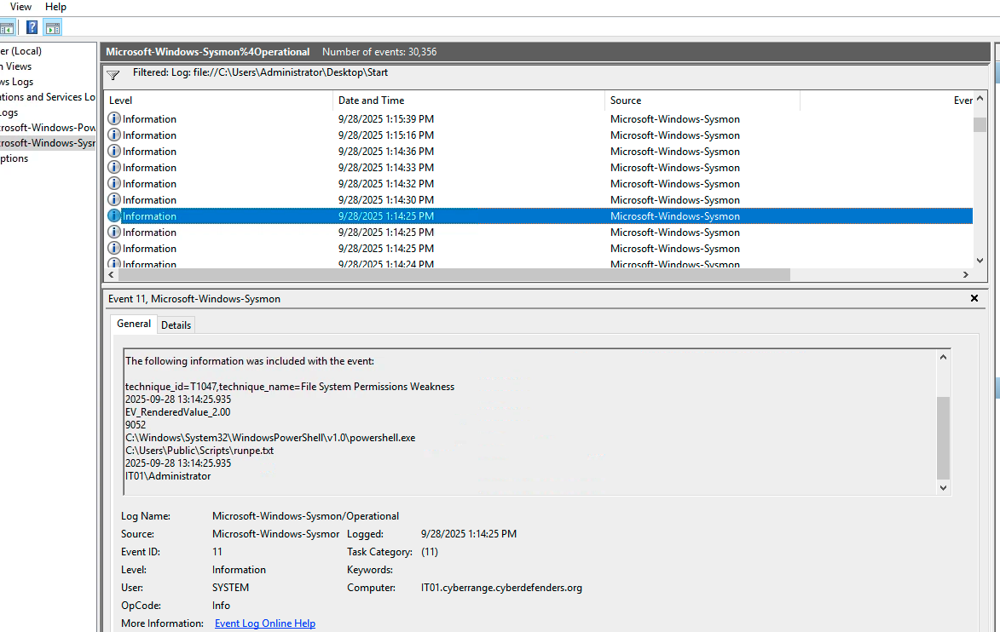

As shown above, I found not one, but two more files downloaded to the victim. This is when I realised that the cargajacerrr.txt file was not actually a downloaded file, but likely a temporary executable. Hence, we found the real target files, ***venumentrada.txt*** and ***runpe.txt***.

---
<br>

***Q5) The downloaded files included obfuscated content that needed to be converted to reveal their true nature. What is the actual file type of the second downloaded file?***

The second file being runpe.txt, we need to find out what the actual type of this file is. With a simple dump command, we can view the magic bytes in its header and figure it out.

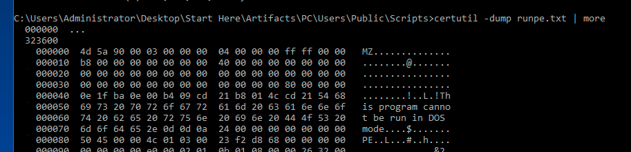

The header is `4d 5a`, which corresponds with a ***`.exe`*** file. This checks out since most malware come in `.exe` files to run something malicious.

And while we're here, we can also check out the venumentrada.txt dump. 

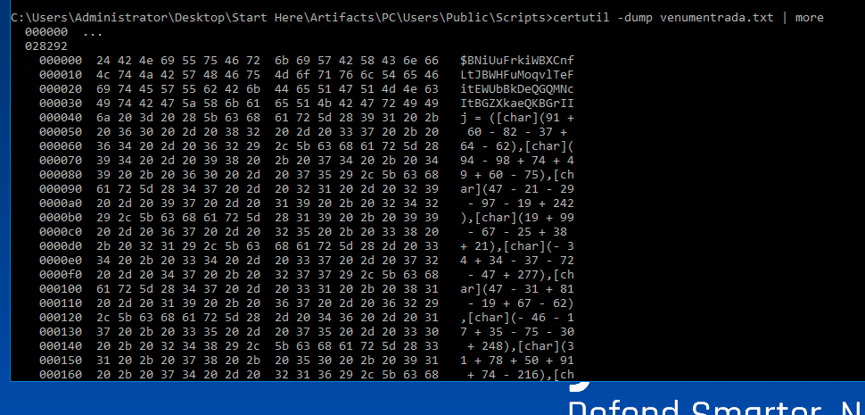

Now this one doesn't match any magic bytes, but seems like some sort of loader or malicious script. This doesn't have anything to do with the question, but just something interesting to note down in case we need it later.

---
<br>

***Q6) The first downloaded file converted the second file to its original format, saved it, and then executed it. What is the name of the executed file that was run after conversion?***

I was first tempted to decode the venumentrada.txt file, but upon printing its contents, quickly realised it was impossible (or atleast very tedious). Instead, I looked in Sysmon again for clues and found another `.exe` file right after the two downloaded files.

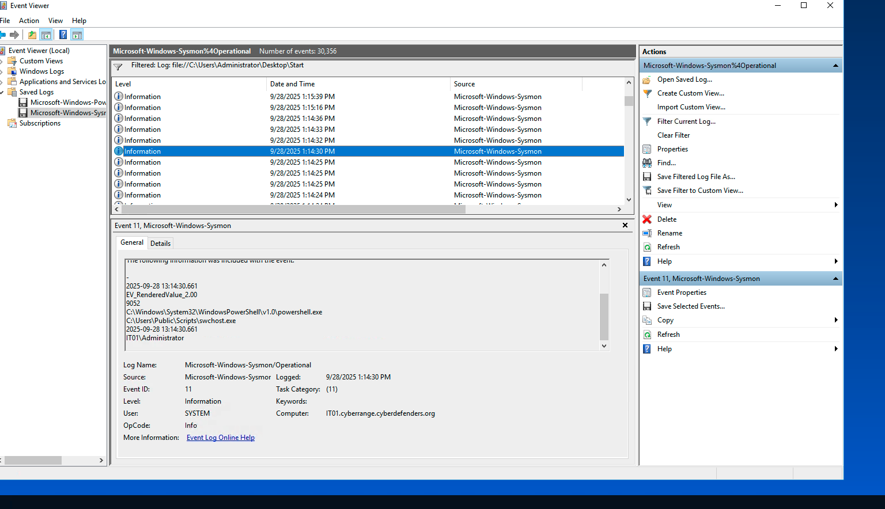

Apart from appearing directly after the downloaded file logs, the ***swchost.exe*** is a legitimate file which is commonly impersonated bn malwares. The swchost.exe file handles Windows system services like updates.

It also shows up in another path in the next log, `C:\Users\Administrator\AppData\Roaming\host\swchost.exe`. This could be useful info later in the lab.

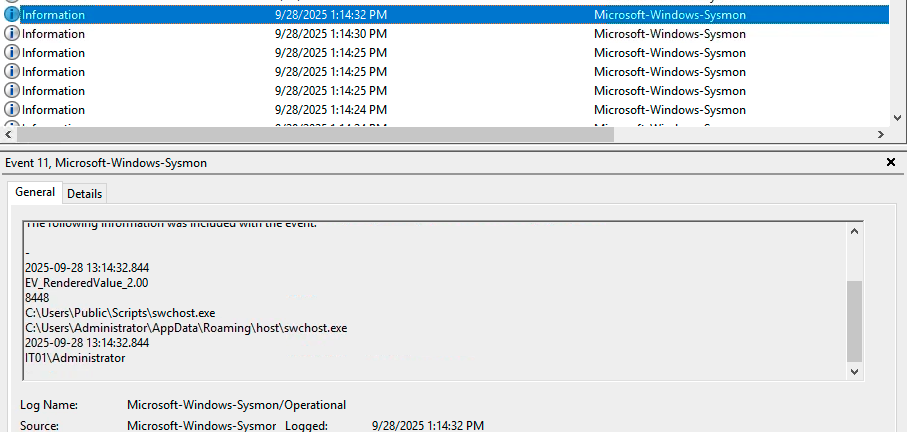

---
<br>

***Q7) The initial JavaScript file employed specific technique to evade security controls and prevent detection. What is the MITRE ATT&CK technique ID for the method used by the JavaScript file?***

Looking through the logs, we can see many different MITRE attack techniques for each one. I began by checking out the technique identified for the invoice log and found T1574.002, Hijack Execution Flow: DLL Side-Loading.

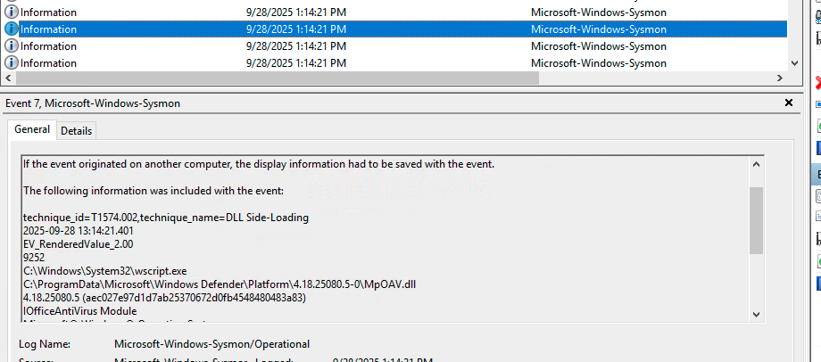


Admittedly I didn't understand any of it and simply plugged the answer in, hoping it was correct. Ofcourse, it wasn't.

After trying other variations of techniques in different logs, I finally decided to take a look at what the js file was doing and trying to map it to a technique myself.

Looking at the js file again, I noticed the line `"-Command Set-MpPreference -DisableRealtimeMonitoring $true"`. This seemed interesting, as DisableMonitoring is a form of security evasion. Also, the command is run alone, not with anything else, meaning it was not essential to the js file, other than to disable security.

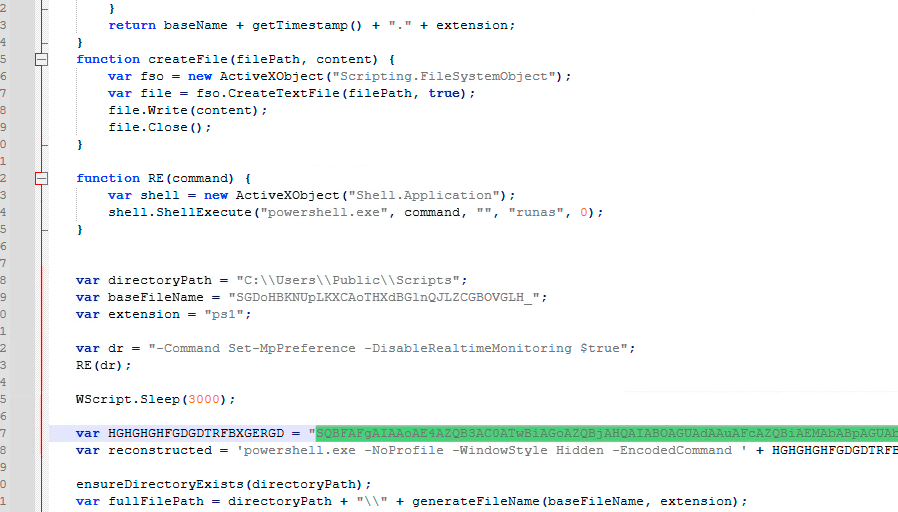

Doing a simple google search on the method, I found a match in ***T1562.001, Impair Defenses: Disable or Modify Tools***, which is our correct answer.

A lesson learned here is not to focus much on the Sysmon identified techniques as they are matched according to each individual log. Here, we are trying to match a technique to the attacker's intention, not simply the execution.

---
<br>

***Q8) The malicious executable modified multiple security-related registry keys to weaken system defenses. How many registry keys were edited by the malicious executable?***

We can solve this by filtering for event ids 13 in the sysmon logs. Event ID 13 logs when a process modifies and existing registry value. Doing so, we can clearly see where the malicious swchost.exe, identified by the path `C:\Users\Administrator\AppData\Roaming\host\swchost.exe`. 

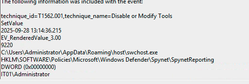
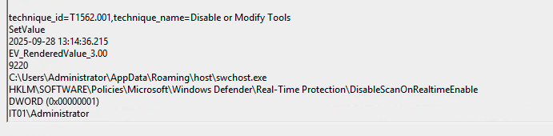

As shown above, they all map to the technique we identified earlier, and we can clearly see security related tools being disabled like Spynet and Real-Time Protection. Counting all the logs, there are ***12*** in total.

---
<br>

***Q9) The malicious executable established communication with a C2 server infrastructure. What is the IP address of the C2 server that the malicious executable contacted?***


Referring back to the same image earlier, we already deobfuscated the powershell command used to setup the communication with the C2 server. Hence, we know the IP address is ***3.122.239.15***.

---
<br>

***Q10) As part of its persistence strategy, the malware created a copy of itself in a different location. What is the full path where the malware copied itself?***

Another relatively easy one. While investigating the swchost.exe commands, I noticed another log after the first one. 

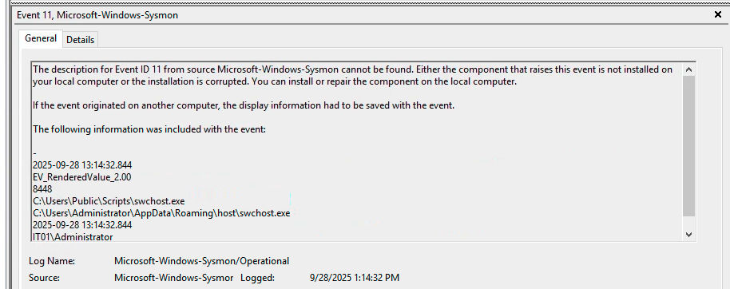

Though no description is given, it seems likely that the file copied itself since the only info given are the two files with different path names. Hence, we found the new path to be ***C:\Users\Administrator\AppData\Roaming\host\swchost.exe***.

---
<br>

***Q11) To maintain persistence after system reboots, the executable added an entry to a specific registry location. What is the full path of the registry key where the executable added its persistence mechanism?***

Once again we're looking at Event ID 13 logs. Opening up the first instance of the `C:\Users\Public\Scripts\swchost.exe` path, we immediately find the registry run key path.

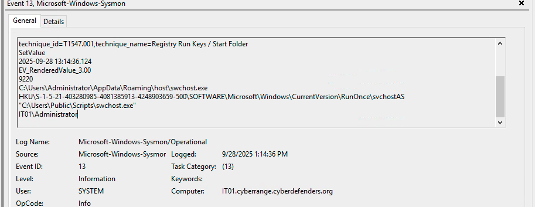

In the path above, HKCU stands for HKey (Handle to Registry Key) Current User, and the odd number after it is just the expanded form which is essentially irrelevant here. Since HKCU depends on the user, it's ambigous and so we don't include it in the path for this answer. Hence, the full canonical path is ***SOFTWARE\Microsoft\Windows\CurrentVersion\RunOnce\svchostAS***.

Just another thing to note in DFIR analysis, we can see that the registry run key does indeed run repeatedly, as almost all logs after it refer to this persistence attack, making it rather easy to locate actually.

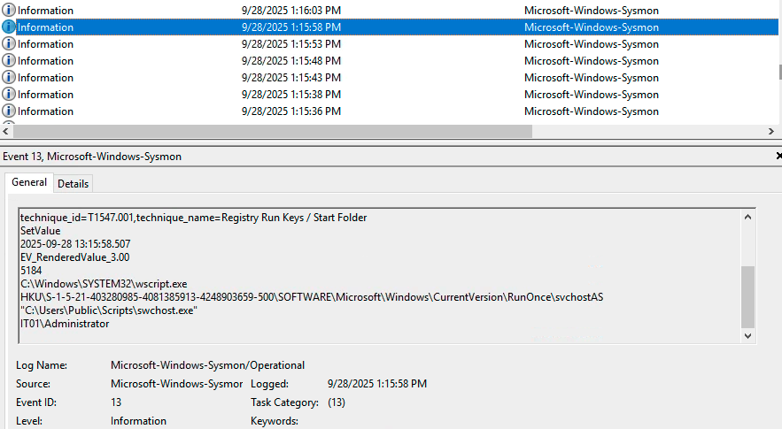

---
<br>

***Q12) A VBS script was deployed as an additional persistence mechanism to maintain the malware's presence. What is the name of the VBS script executed by the malicious executable for persistence?***

This was pretty easy as well. This time we look for Event ID 11 since the VBS script must have been created first before running. A simple search in Find for `.vbs` gives us our answer.

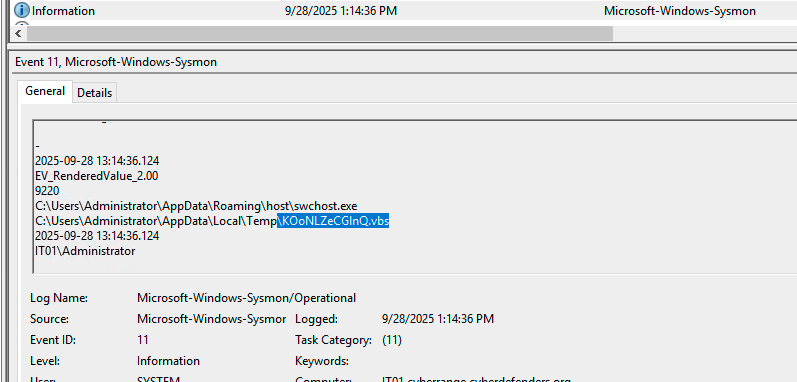

Clearly this is the file we are looking for given it's Image being the copied location of the swchost.exe malicious file. From here, we know our file name is ***KOoNLZeCGlnQ.vbs***.

```
Note that the file cannot be found in the Temp folder, likely because it was removed to avoid detection. This is made easy by the fact that it was in the Temp folder, and as the name suggests, most files are removed eventually.
```

---
<br>

***Q13) To ensure the malware process couldn't be terminated easily, it used a specific Windows API function to mark itself as critical. What Windows API function does the malicious executable use to mark its process as critical to the system?***

Doing a simple google search for this, I found that the common method to set a process as critical is to use ***RtlSetProcessIsCritical***. 

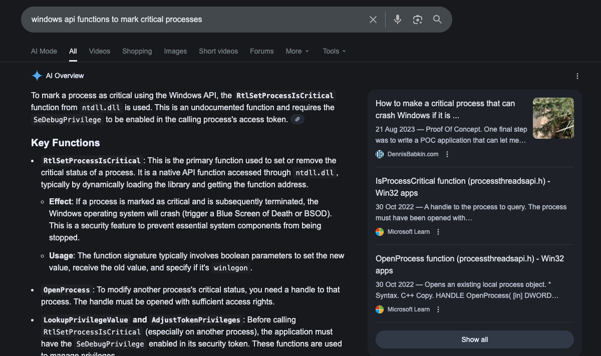

However, I was unable to find any evidence to back it up. After further research and ChatGPT prompting, I learned that this answer doesn't have any specific log to back up as evidence. It's simply a common way to set a process as critical and hence we can flag it as the answer (and it's correct according to cyberdefenders). However, in the real-world, this we can't be 100% sure, which is simply part of real analysis - not everything is black and white.

---
<br>

***Q14) The threat actor deployed an additional executable specifically designed for data collection activities. What is the name of the executable dropped for data collection purposes?***

This one took me a little longer than it should've. Looking through all the Event ID 11 logs, I couldn't find anything initially in the initial attack period. I then pivoted to the other log IDs, but to no avail.

Eventually, by sheer luck, I happened to search swchost.exe on the sidebar and found an Event ID 11 log hidden much later on.


As shown above, a file named ***Flfs6heTV2lb.exe*** is created, likely for exfiltration purposes as it was made hours after the initial attack, giving it ample time to collect data.

---
<br>

***Q15) After gathering sensitive data, the malware compressed the collected information into an archive for exfiltration. What is the exact timestamp when the collected data archive was created? (in 24-hour format)***

And on to our final question, luckily this log is right after the previous one which created the data exfiltration file.

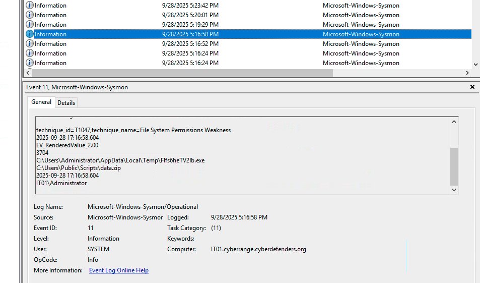

As we can see, a zip file is created with the data to be exfiltrated. From the timestamp, converting to 24 hour time, we get our final answer, ***2025-09-28 17:16***.

---
<br>

### Conclusion and Thoughts
Easily the longest lab I've done, this was a marathon compared to my previous ones. I was thrown a bit into the deep end for this one, having little endpoint forensics experience. I was shocked to see I'd been given an entire disk, considering I was used to neat PCAPs and logs already pipelined to Splunk or Wazuh. 

However, I thoroughly enjoyed navigating the entire disk and trying to find corresponding logs for my challenges. I came to really appreciate the power of Sysmon in logging everything (quite literally everything) and filtering through them to find my IOCs. In hindsight, many clues and details were clustered around the initial attack and the lab wasn't too hard, but the learning curve at the beginning was a little steep.

Still, I enjoyed the forensic aspect of this lab, as well as the length. Despite a little struggle initially, I was rewarded for my efforts later on, where I had already spotted or noted down odd files/logs that were asked in the following parts. This made the second half of my lab rather easy, as I remembered all the suspicious logs I had spotted earlier, but were irrelevant at the time.

I think this lab has given me a much better understanding of forensics and how it's done in the real world (though far easier). One thing I noticed was that the setting of a lab gave me the comfort of checking my answers, which you don't get in the real world. Completely not checking my answers might not be wise, but I'll try to approach the lab section-by-section instead of each question, to ensure I'm investigating without the training wheels of answer checks.

Overall a great lab and fun learning experience. Looking forward to more endpoint forensics, and the nitty-gritty low level memory stuff!

---
<br>

### Additional Info
> In this writeup it was mentioned that the swchost.exe is a real process and it was impersonated by a malicious one. This is incorrect, as the real process is ***svchost.exe*** (v instead of w).


