# Sigma101


---

### Lab Summary
In this lab we slip into the shoes of a detection engineer, trying to write sigma rules detecting and mitigating attackers performing lateral movement on our networks. Our job is to write rules to detect 3 levels of logs, each with different MITRE rule mappings.

While this was a medium difficulty lab, I definitely found it a lot easier than some of the easy labs on cyberdefenders. Sigma101 didn't really build on the SigmaPredators lab, but still allowed me to practice writing rules and trying to keep them comprehensive yet concise to maximize effectiveness. 

However, on subsequent labs, I'd like to write more complex rules such as rule-packs, working with multiple sources at a time. In addition, real-world rules outline behaviour and timelines more than specific processes run, which I think will be more interesting to work with.

MITRE Techniques:
- T1218 - Signed Binary Proxy Execution (Q1)
- T1546.015 - COM-Based Execution (Q1)
- T1055/T1055.012 - Process Injection/Hollowing (Q2)
- T1562.001 - Impair Defenses (Q3)

Anyways, that's all for the quick summary. Enjoy the writeup!

---

***Q1) In the first log file, analysts identified a malicious process running on one of the systems. To enhance the organization's detection mechanisms and ensure future detection of such activities, craft a Sigma rule targeting this process. Once the rule is developed, submit the Level 1 flag.***

Starting off, we are given a 'Start Here' folder with 3 levels of artifact logs. This lab expects us to go through the logs for each level, and come up with a sufficient rule to identify the log. Now while the exercise simply requires a rule to match it, I've decided to try to expand the rules to be as comprehensive as possible to mimic real world rule writing. But first, let's take a look at our logs.

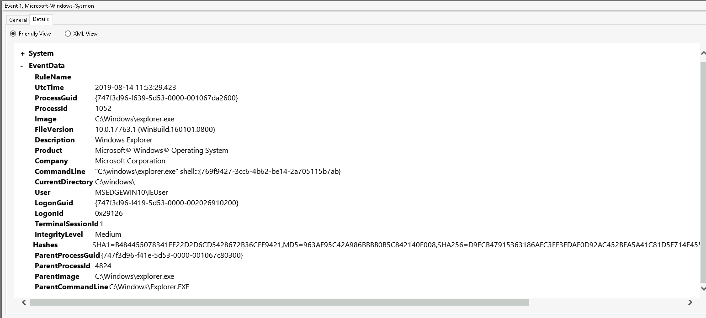
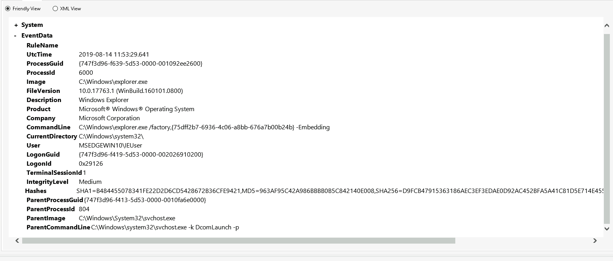
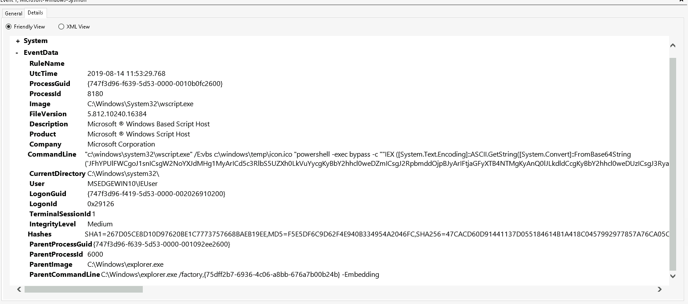

As we can see above, there are 3 distinct steps in this attack:
1. Attacker exploits explorer.exe to open up a shell (` "C:\windows\explorer.exe" shell:::{769f9427-3cc6-4b62-be14-2a705115b7ab} `)
2. Attacker uses shell to create another explorer using factory (`C:\Windows\explorer.exe /factory,{75dff2b7-6936-4c06-a8bb-676a7b00b24b} -Embedding`)
3. Attacker runs a malicious obfuscated command on wscript shell spawned

For point 2, I had to do some research into the command used. `/factory` is used when explorer wants to open a COM server, which essentially allows explorer to run specific tools without running the whole program. Importantly, it does this quietly, and so I researched the GUID that was given and found that it was simply spawning another explorer silently, to run its malicious scripts from.


Now as for the command, I tried to deobfuscate it as shown above (already convertde from base64 and extra deobfuscation using python scripts) but I realised it was futile and ultimately unnecessary. After all, I already had all the information I needed to write my rule.

The main logic of our rule is simple. Catch any behaviour where the explorer.exe process spawns a scripting process (powershell.exe, cmd.exe, wscript.exe). Explorer.exe _can_ spawn a scripting child process, but it's very rare, and definitely worth noting even if it's a false positive. 

Now that we have our rule logic, we can go ahead and write our rule.

```
title: Explorer spawning suspicious LOLBins
id: 41beed0d-45f6-4347-91a0-76309e4b4309
status: experimental
description: Detects explorer.exe spawning commonly abused Windows LOLBins.
logsource:
  category: process_creation
  product: windows

detection:
  selection_parent:
    ParentImage: 'C:\Windows\explorer.exe'
  selection_image:
    Image:
    - 'C:\Windows\System32\powershell.exe'
    - 'C:\Windows\System32\wscript.exe'
    - 'C:\Windows\System32\cscript.exe'
    - 'C:\Windows\System32\mshta.exe'
  condition: selection_parent and 1 of selection_image

```

And testing it in Hunter X Hunter, the tool given to us for this lab which runs chainsaw under the hood, we get the flag ***cyberdefenders{c086ea1c-d744-4942-b253-b87c417f97cc***.

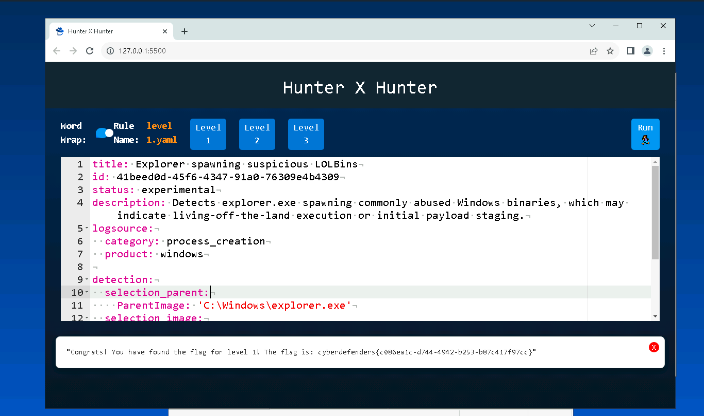

---

***Q2) In the second log file, the SOC team identified a process hollowing technique being used by a malicious executable. Can you create a Sigma rule for this process hollowing technique? Once you've developed this rule, submit the Level 2 flag.***

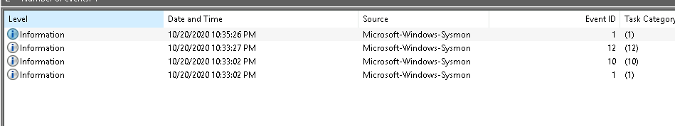

In this level, we're given 4 logs to work with. The attack can be broken into the following steps:
1. Event ID 1, rundll32.exe process is used to spawn the wermgr.exe process, which is the Windows Error Reporting Manager.
2. Event ID 10, rundll32.exe is requesting access `0x1fffff` (all rights) to wermgr.exe which is highly suspicious.
3. Event ID 12, wermgr.exe is creating a key in the registry connected to Internet Settings.
4. Event ID 1, WmiPrvSE.exe is run without a parent image.

Since the rule outline lists logsource category as process_creation, we can focus simply on the Event ID 1 logs (since we can't write rules for the others anyways, even if they're suspicious). Hence, I've chosen to show only those 2 logs:

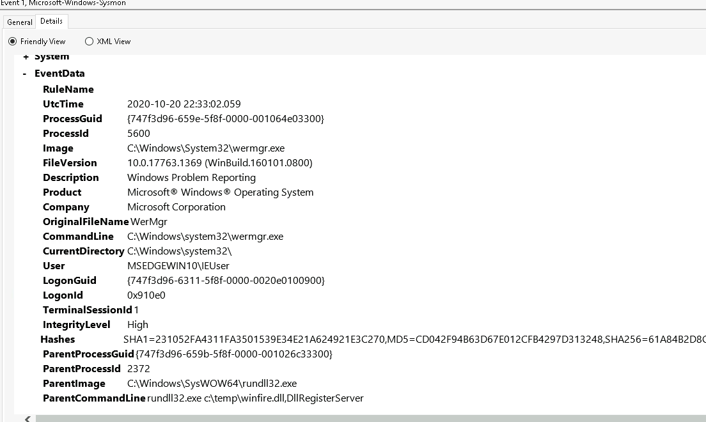
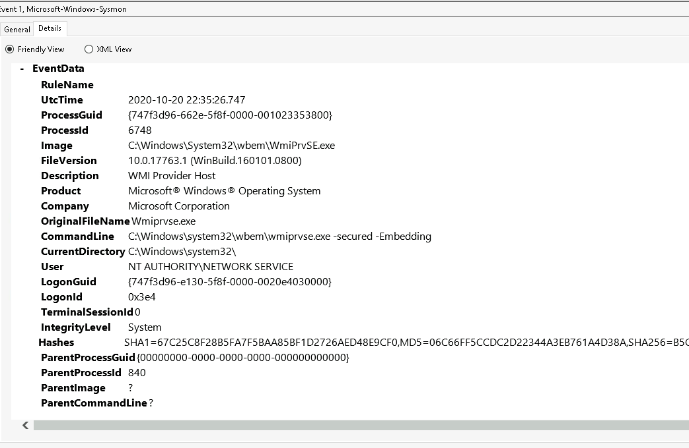

Now I wanted to start with the first suspicious activity, where rundll32.exe spawns wermgr.exe. This is a very suspicious activity, and hence warrants a check in our rule. So we get our prototype rule:

```
tite: Detect process hollowing by malicious executable
id: generate one here https://www.uuidgenerator.net/version4
status: experimental
description: Identifying creation of wermgr.exe process with parent rundll32.exe
logsource:                      # important for the field mapping in predefined or your additional config files
    category: process_creation  # In this example we choose the category 'process_creation'
    product: windows            # the respective product
detection:
    selection_images:
        ParentImage|endswith: '\rundll32.exe'
        Image|endswith: '\wermgr.exe'
        # FieldName3|modifier: 'Value'
    condition: selection_wmi

```

Using this rule, we get the following output:

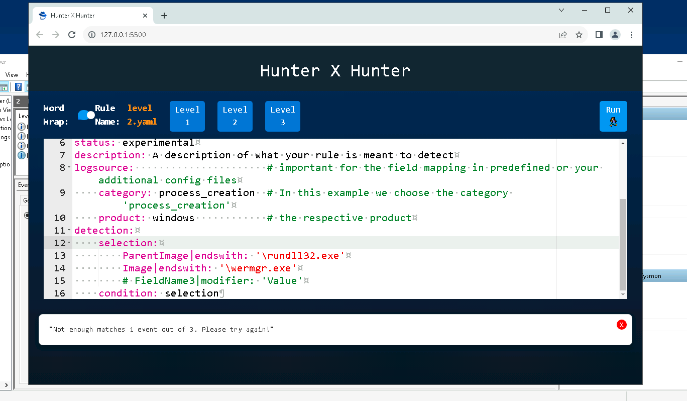

Successful, but not the whole thing. Moving on, we know that the 2nd process creation log is of WmiPrvSE.exe being run without a parent image. This was highly suspicios to me, and a google search confirms the same.

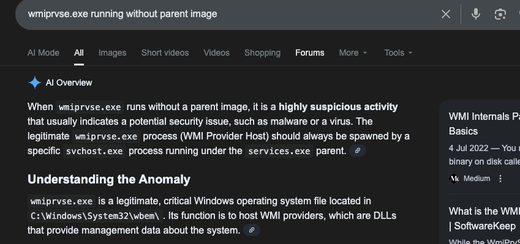

Hence, I appended this to my rule. However, I got an odd result.

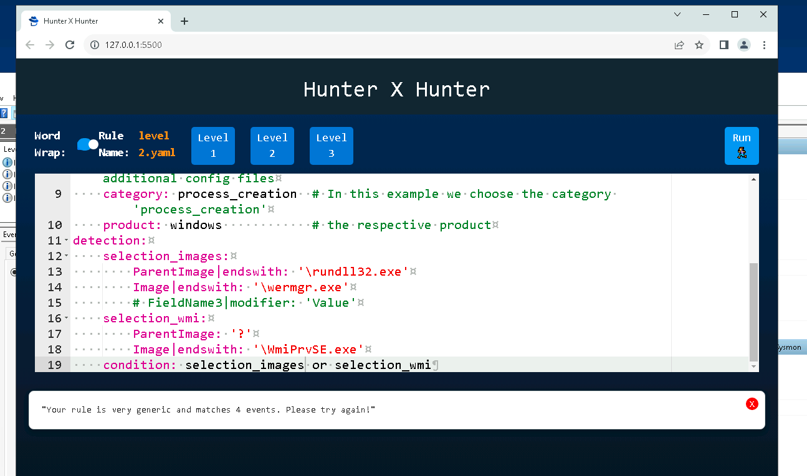

This struck me as odd, and I experimented trying more fields. In the end, it turns out our initial rule for rundll32.exe spawning wermgr.exe was wrong. rundll32 can spawn wermgr during app crashes and errors, making it valid and hence creating false positives. So, narrowing down to just WmiPrvSE.exe without parent image, we are able to get the answer.

```
title: Detect process hollowing by malicious executable
id: generate one here https://www.uuidgenerator.net/version4
status: experimental
description: Detecting process hollowing with suspicious spawning of WmiPrvSE.exe without a parent image
logsource:                      # important for the field mapping in predefined or your additional config files
    category: process_creation  # In this example we choose the category 'process_creation'
    product: windows            # the respective product
detection:
    #selection_images:
        #ParentImage|endswith: '\rundll32.exe'
        #Image|endswith: '\wermgr.exe'
        # FieldName3|modifier: 'Value'
    selection_wmi:
        ParentImage: '?'
        Image|endswith: '\WmiPrvSE.exe'
        CommandLine|contains: '-Embedding'

    condition: selection_wmi

```

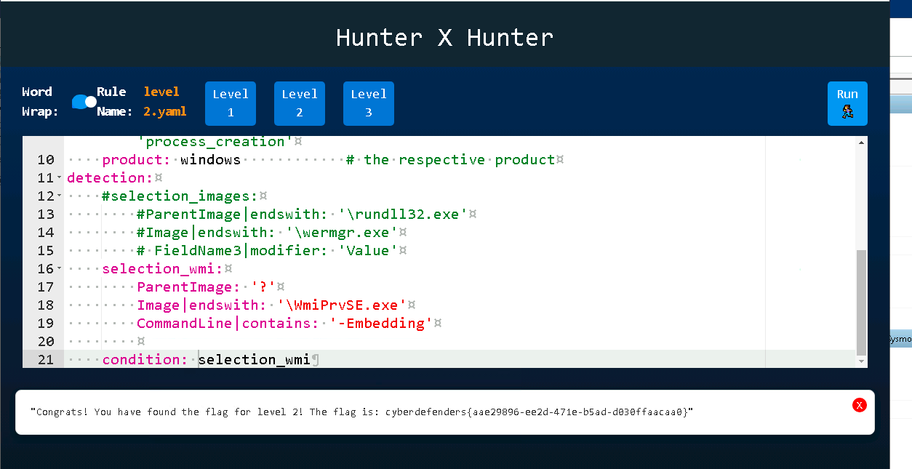

And so our flag is ***cyberdefenders{aae29896-ee2d-471e-b5ad-d030ffaacaa0}***.

```
A side note for this part, the question says process hollowing is taking place. However, after researching and prompting ChatGPT, I'm unable to find any conclusive evidence that this is a form of process hollowing, rather process injection.

The difference is that process hollowing requires the program to be suspended, which I cannot seem to find evidence of from the logs. It's not necessary to solve it, and it's possible that the logs set up the hollowing attack further on, but just wanted to add this note since it confused me a little initially.

```

---

***Q3) In the third log file, concerns are raised due to its indication of a defense evasion tactic. In an effort to proactively detect such stealthy maneuvers in subsequent instances, can you craft a Sigma rule targeting this specific activity? Once you've developed this rule, submit the Level 3 flag.***

Our third and final level is relatively easy, given we only have 1 log to work with.

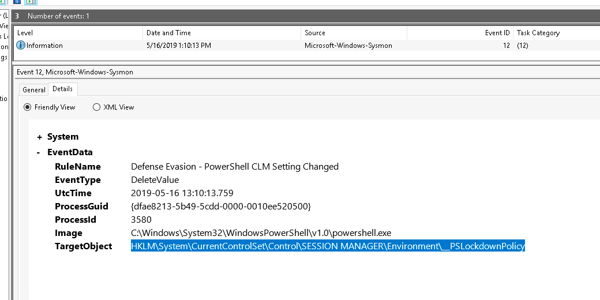

We can see this is a defense evasion tactic, where a value is deleted in the registry storing the rights for powershell processes running. Powershell can be run in Full Language Mode or CLM, Constrained Language Mode. In this case, since it's delete value, we know that the attacker is escalating their powershell privileges by removing `_PSLockdownPolicy` value from what it was to none, which is Full Language Mode.


Hence, all we need to do is identify any logs that tamper with the registry in this way (whether to set escalate privileges or even vice versa to act benign). Our rule is therefore pretty simple. Notice our source is registry_event here (turns out we could've used it earlier to, but guess it wasn't necessary in the end) since our Event ID is 12, corresponding to registry events.

```
title: Detects defense evasion through powershell mode changes
id: generate one here https://www.uuidgenerator.net/version4
status: experimental
description: Detect if an attacker tampers with _PSLockdownPolicy registry to change powershell modes
logsource:
    category: registry_event  # In this example we choose the category 'process_creation'
    product: windows            # the respective product
detection:
    selection:
        Image|contains: '\powershell.exe'
        TargetObject: 'HKLM\System\CurrentControlSet\Control\SESSION MANAGER\Environment\__PSLockdownPolicy'
    condition: selection

```

And running this rule on Hunter x Hunter, we get:


And that's all for this lab! Thanks again for reading my writeup.

---

