# SigmaPredator
<br>
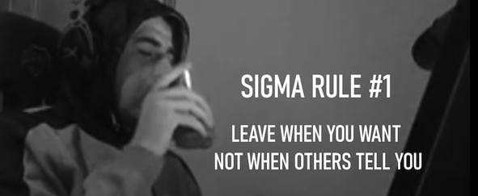
<br>

### Lab Summary

In this lab, we’re stepping into the shoes of a Detection & Hunting engineer, working on analysis of an Indicator Removal (Windows Log Clearing). Our goal is to deconstruct this technique, identifying tools and traces to write a detection rule and validate it.

This is my first foray into rule detection writing. Given that the ultimate goal in cybersecurity is to protect and mitigate, as oppposed to detecting when damange is done, I feel this was an essential lab for me. It gave me an introduction to writing rules by first researching logs and traces involved in the technique, and simply putting them together.

I got the chance to write 3 rules in this lab, identifying event log clearing through ScriptBlock logging (powershell), native CLI utilities, and Windows event logs. Researching tools such as wevtutil, and cmdlets like Clear-EventLog, I was able to piece together rules to identify the necessary timestamps.

Overall, I gained exposure into researching for writing detection rules, and the format they follow. My goal is to follow up this lab with a few more, and maybe jump into my homelab to continue writing more complex and comprehensive rules.

MITRE Technique
- T1070.001

Tools & Concepts Learned
- Sigma Rules
- Windows Log Clearing
- Chainsaw Hunting

Enjoy the writeup!

---

### Technique Research

***Q1) Process Creation Detection: Which built-in Windows command-line utility provides native support for managing—and in particular clearing—event logs?***

Working on my previous lab, RevengeHotels APT, I recall using wevutil to dump logs into a file and analyze them. So when I spotted it doing some googling on windows utilities for logs, I found some useful info.

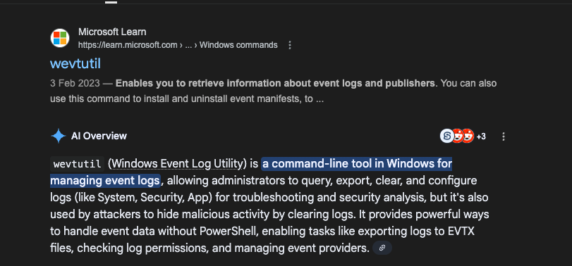

As shown above, ***wevtutil*** (Windows Event Log Utility) is used to manage logs on Windows. Specifically, we can use it to clear logs of Security, Application, System, etc (`wevtutil cl Security`). Since it's a legitimate windows tool, it is considered a LOLBin, which attackers love to use to avoid detection.

---

***Q2) Process Creation Detection: Which WMI class typically appears in logs when attackers use WMIC commands to clear critical Windows event logs via the command line?***

WMI (Windows management Instrumentation) classes are used to define information or actions. I like to think of it from an Object Oriented Programming (or OOP) lens. It contains classes which can be instantiated as objects. Each object has fields of information, and methods for actions.

Attackers like WMI classes because:
- They're built into Windows, hence LOLBin
- Can call methods/actions directly, without the need to spawn executables (like cmd.exe), making it harder to detect.

However, they are also useful for detection engineers, especially for writing rules, since WMI classes are stable and well-defined. They don't change like file/executable names or hashes. Hence, it's easy to write concrete rules with them.

Now back to the question at hand:

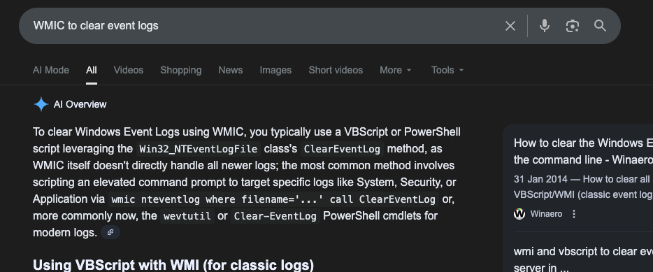

As shown above, we can see ***NTEventLogFile*** uses the ClearEventLog method to carry out the clearing, and hence what we're likely going to be looking for later on in this investigation.

---

***Q3) PowerShell Detection: Which PowerShell logging channel must be enabled to capture this technique’s execution, and which Event ID should be monitored as recommended in the MITRE ATT&CK technique page?***

Admittedly I needed to use a bit of ChatGPT for this one. I had no idea what a logging channel was and couldn't really find any clues in the MITRE ATT&CK page.

After some prompting, I got the answer ***Powershell Script Block Logging, 4104***. A little vague, but a quick google search on powershell Event IDs and we can see that it's a commmon and vital channel for logs.

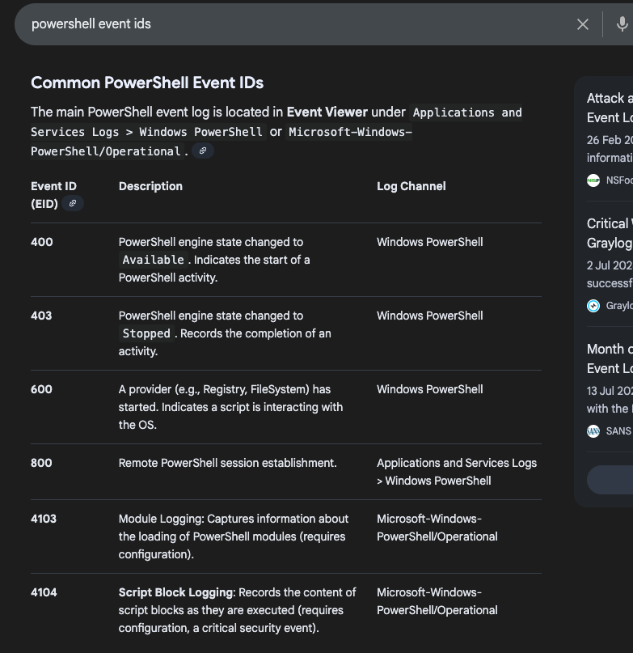

Without this channel turend on, we can see powershell booting up and running, but not actually what's being run. 99% of labs I've done previously have been analysing these logs, and without them it's difficult to understand what exactly the attacker did.

---

***Q4) PowerShell detection: Which built-in PowerShell cmdlets are commonly leveraged by attackers to clear Windows Event Logs?***

From researching online, I noted down Clear-EventLog as the most commmon cmdlet (method) to clear logs. However I was a bit stumped finding the second one.

I thought Get-WinEvent initially but that is just a step in clearing the log, not the actual cmdlet to do it. Eventually, searching for alternatives to Clear-EventLog, I was directed back to the T1070.001 technique page.

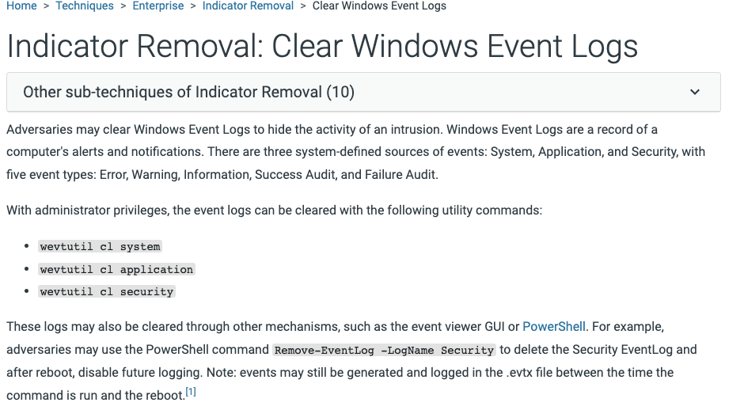

It was right there all along 😅. We can go ahead and note down ***Clear-EventLog & Remove-EventLog*** as the two cmdlets for clearing Windows event logs.

---

***Q5) PowerShell detection: Which native .NET API methods in the System.Diagnostics.Eventing.Reader and System.Diagnostics namespaces can an attacker invoke from PowerShell to clear Windows Event Logs?***

Once again, a couple of google searches will give us the following:

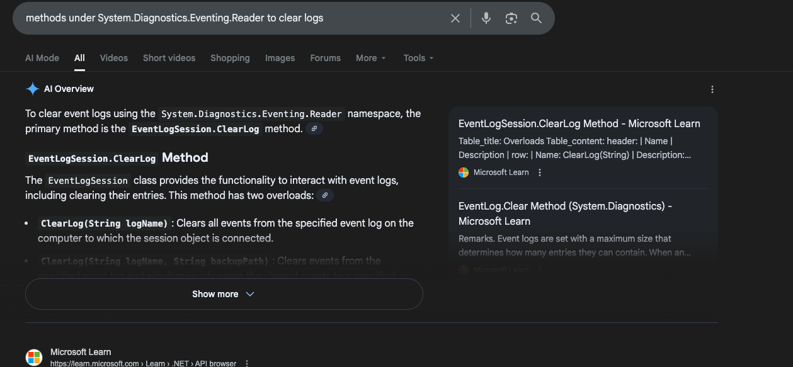
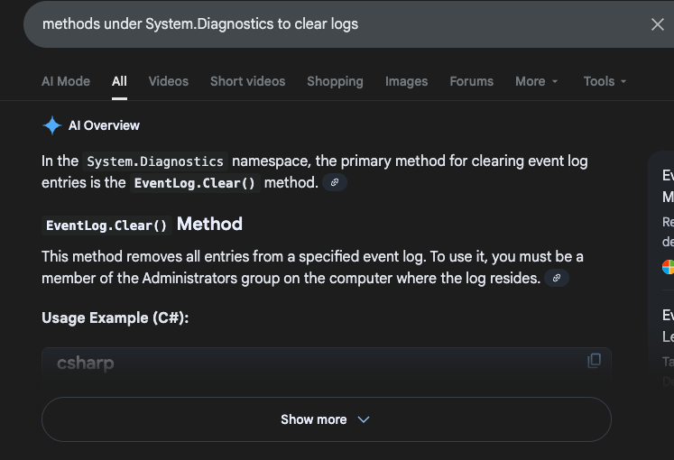

.NET APIs are a bit like libraries - ready made classes and methods to perform certain actions. Essentially, an attacker can invoke these and carry out the methods ***EventLogSession.ClearLog & EventLog.Clear*** to clear the windows event logs.

---

***Q6) File Deletion Detection:  Which Windows Event IDs should be monitored to detect the clearing of System or Security event logs as an indication of potential log removal?***

Another google search gives us the final answer for this section.

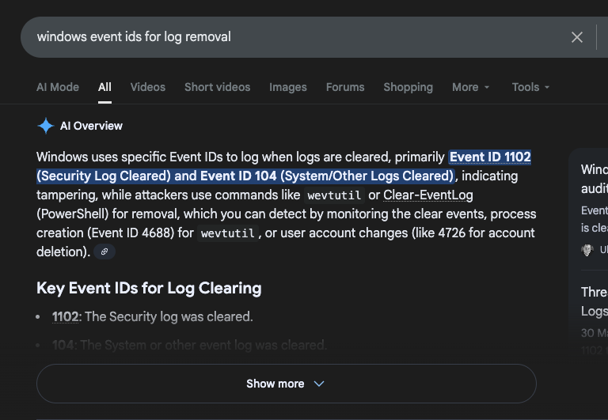

The logs are ***1102 & 104*** which track security and system/other logs respectively. Now with the theory out of the way, let's move on to the fun part - rule writing.

---

### Rule Development

***Q7) PowerShell Detection: Create a Sigma rule to detect event log clearing through ScriptBlock Logging. Validate it using Chainsaw with your historical logs. What is the timestamp of the earliest detection?***

Now for this part, we are only allowed to detect logs through ScriptBlock logging. With this hint, we can narrow down the rule to depend on the first few clues we figured out earlier in this lab.

Specifically, we know that wevtutil must be used to clear logs if done so using a script, and hence we are looking for the `wevtutil cl` line somewhere in the log.

```
Note: I want to acknowledge that the rules written in this lab were aided by AI (ChatGPT). With this being my first time writing Sigma rules, I wanted to focus less on syntax and format and more on the actual logic. As a result, I provided my logical reasoning to come up with these rules, but ChatGPT wrote and formatted them for me. 

Now that I'm familiar with Sigma rule writing, I am confident that I will be able to write them on my own in future labs.
```
With this rule logic set, I came up with the following rule:

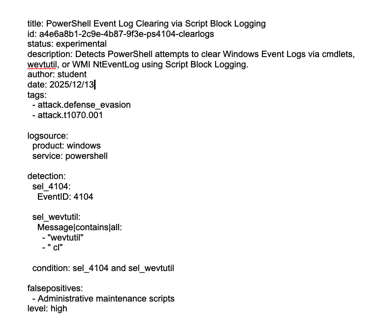

Now running chainsaw with the command `chainsaw hunt logs --mapping "C:\Users\Administrator\Desktop\Start Here\Tools\Log Analysis\chainsaw\mappings\sigma-event-logs-all.yml" --sigma "rules\q7.yml"`, we get the output:

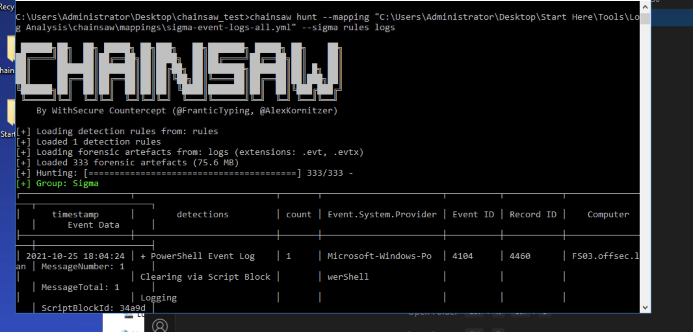

And so our answer for this part is ***2021-10-25 18:04***.

---

***Q8) Process Creation Detection: Create a Sigma rule to detect event log clearing via native CLI utilities (e.g., wevtutil, excluding WMI). Validate it using Chainsaw with the historical logs you have. What’s the timestamp of the latest match?***

Here we are looking at event log clearing with native CLI utilities. In other words, we are allowed to use more than just script block logging (in powershell). We already have a clue when the lab tells us to use Sysmon logs as a source.

Given that the Cmdlets don't appear in sysmon logs and that the other clues are restricted (WMI excluded and .NET binaries disregarded in Q7) we can only look for wevtutil in this rule.

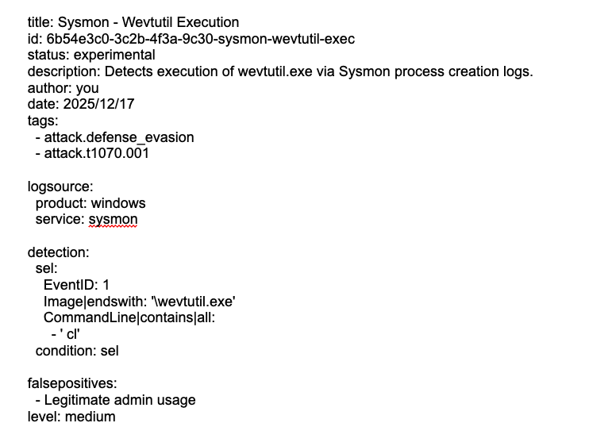

Luckily for us it works!

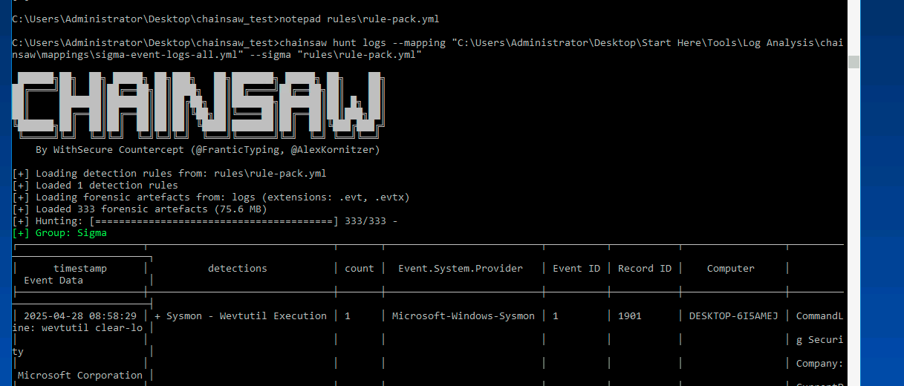

Just to take a better look at this rule detection, we can use the command suffix `--json > hits.json`. This gives us the following info about what exactly triggered this rule (though we know it's wevtutil since it's the only check).

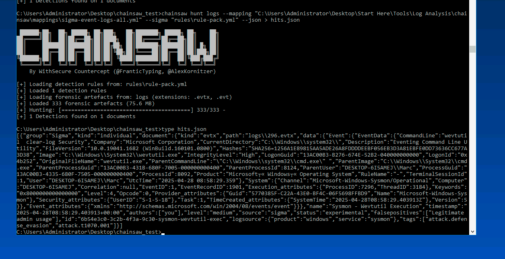

And we have our date, ***2025-04-28 08:58***.

---

***Q9) File Deletion Detection:  Create a Sigma rule to detect event-log clearing. Validate it using Chainsaw with the historical logs you have. What is the timestamp of the earliest match?***

On to our last question, we're aiming to make a comprehensive rule to catch 'em all. Since we already solved the previous two parts, and hence know that the final rule must catch a log earlier than the date in Q7, I decided to cut the excess logic and only check for what we haven't already.

Hence, there's no reference to wevtutil, the Cmdlets, or anything else we've used before. This leaves only one type of log to check: 104 and 1102 windows event logs. A quick prompt and I got a simple rule to identify these logs:

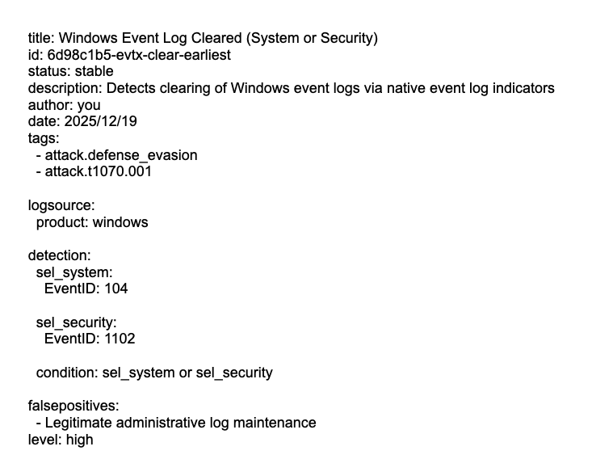

Running this on chainsaw, we get the output:

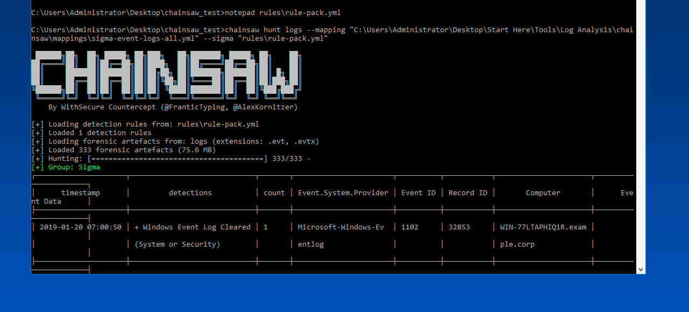

And voila! We have our final timestamp, ***2019-01-20 07:00***.

---


