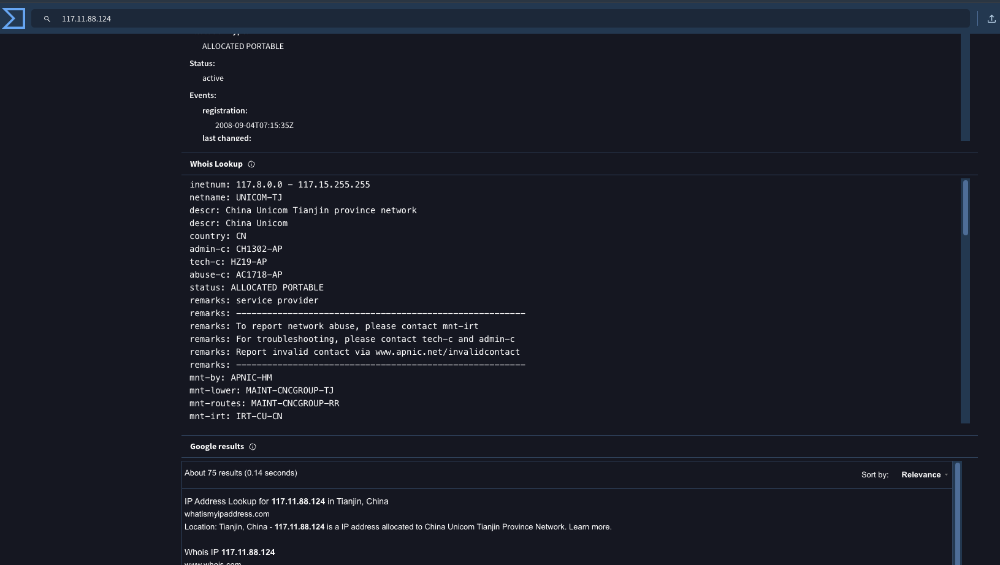
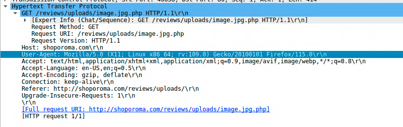

# WebStrike
### Introduction
In this lab our objective is to investigate a wireshark PCAP detailing an attack on a company's webserver.

***Q1) Identifying the geographical origin of the attack facilitates the implementation of geo-blocking measures and the analysis of threat intelligence. From which city did the attack originate?***

Although this was an easy question, it did trip me up a little bit due to the mismatch of source and destination IPs.

As shown above, the source IP ***117.11.88.124*** is the source IP - and attacker. However, from all previous challenges I've done, the source is usually the victim, making an accidental request to an attacker.

However, in this case since the victim is a company webserver, it makes sense that the attacker sends malicious GET requests. Hence, the source IP is the attacker. This is proven throughout the exercise so we can be sure.

From the IP, a simple search on virus total gives us the city, ***Tianjin***.

***Q2) Knowing the attacker's User-Agent assists in creating robust filtering rules. What's the attacker's Full User-Agent?***

We can simply look at the packet information to find our user agent, ***Mozilla/5.0 (X11; Linux x86_64; rv:109.0) Gecko/20100101 Firefox/115.0***.

***Q3) We need to determine if any vulnerabilities were exploited. What is the name of the malicious web shell that was successfully uploaded?***

Once again, from the previous image, we can see it's ***image.jpg.php***. The `.php` ending is a hint, but the fact that it's after the jpg (an attempt to hide it, and therefore likely malicious) is the giveaway.

***Q4) Identifying the directory where uploaded files are stored is crucial for locating the vulnerable page and removing any malicious files. Which directory is used by the website to store the uploaded files?***

Once again, we can see the directory info in the image, ***/reviews/uploads/***.

***Q5) Which port, opened on the attacker's machine, was targeted by the malicious web shell for establishing unauthorized outbound communication?***

We can simply investigate the conversation between the attacker and company webserver to get this info. As shown above, on IP 117.11.88.174, the port ***8080*** is open.

***Q6) Recognizing the significance of compromised data helps prioritize incident response actions. Which file was the attacker attempting to exfiltrate?***

While I couldn't find this info looking through all the http requests, I realised the file could be in the TCP packets transferred since exfiltration is often done through a reverse webshell. 

My hunch paid off and finding the answer was relatively easy by simply following the TCP stream, giving us file ***passwd***.

-----
 

And that's all for this lab. I found this one pretty easy and just a revision of my basics in wireshark. Nothing much new learned, but good to know that I'm not just learning the concepts, but getting comfortable with them and solving these labs quickly without much difficulty.

