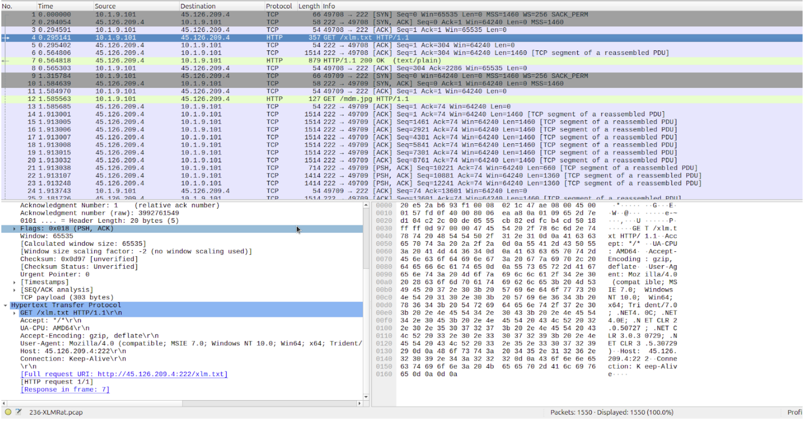
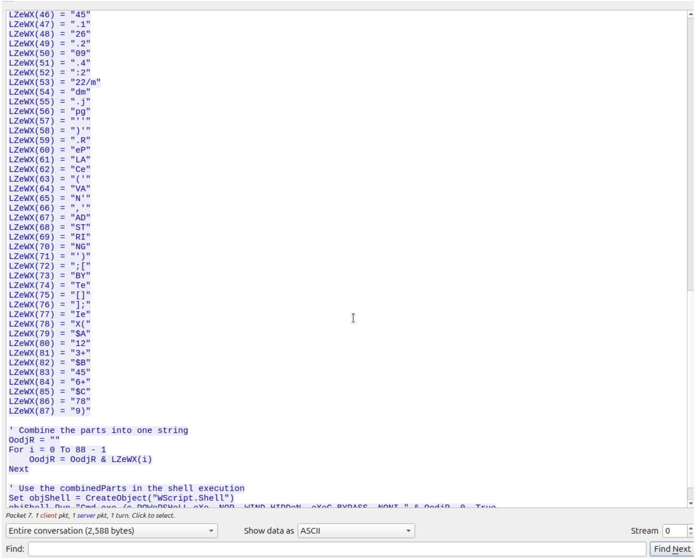
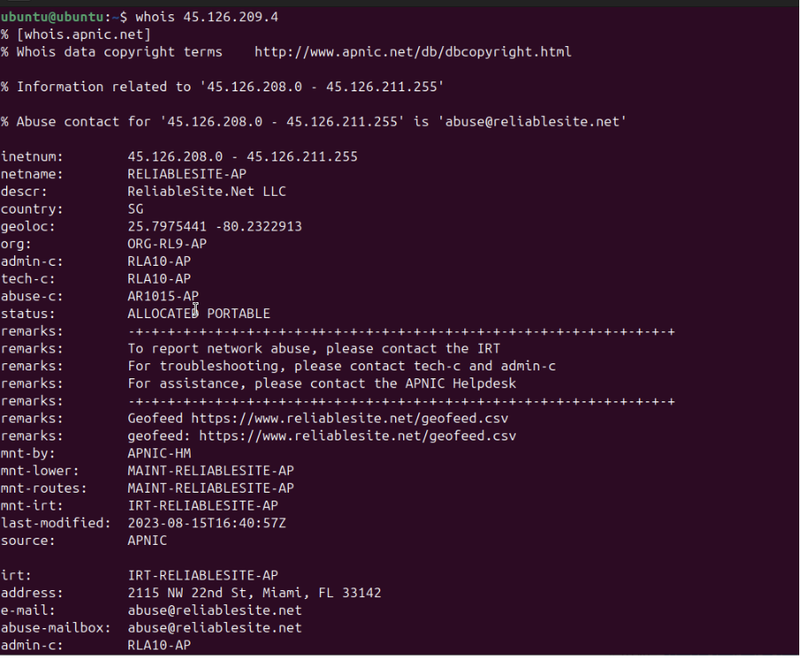
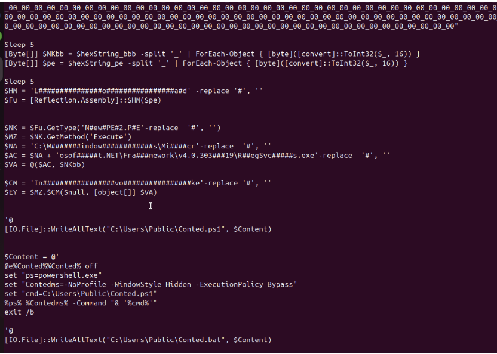
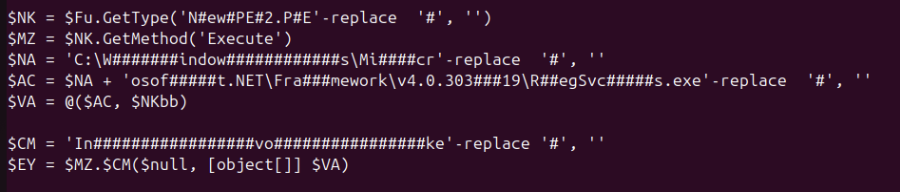
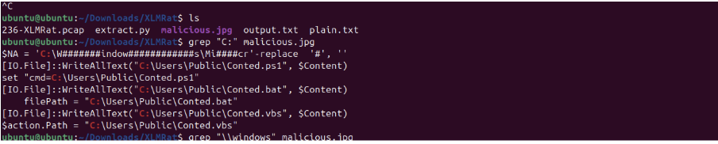

# XLMRat Lab
This is a simple network security lab where we analyze a compromised machine’s pcap. Our goals are to identify the attack method, malicious payloads, and create an event timeline. We’re also looking out for tools and techniques the attacker used to gain access, and the type of malware injected.

***Q1) The attacker successfully executed a command to download the first stage of the malware. What is the URL from which the first malware stage was installed?***

Taking a look at the pcap, we can immediately see a HTTP request early on with an odd path ‘/xlm.txt’. Opening it up, the request is made directly to the IP, bypassing DNS (common malware behavior) and getting a 200 OK request later.

Opening up the response, we can clearly see that it was an injection which led to another GET request being run. The code is in clear text (since it’s HTTP) and we can confirm it ran since the previous image shows us a GET request to /mdm.jpg soon after the response. This is our answer to Q1, the URL to install the malware initially.

***Q2) Which hosting provider owns the associated IP address?***
We can simply run whois on the given IP to find the provider.

***Q3) By analyzing the malicious scripts, two payloads were identified: a loader and a secondary executable. What is the SHA256 of the malware executable?***

Now this question was a bit annoying as I immediately assumed the mdm.jpg was the malware executable in this scenario. Trying many python scripts to extract and hash the entire payload within quotations, I kept failing.

Instead, the answer was pretty much in plaintext below, explaining the attack in more detail and which hex payloads were the loader and executer.

As shown above, two different hex_strings are being used, hexString_bbb and hexString_pe. Now we can see that in the lines below the declarations, $HM(pe) is being run, where $HM is ‘Load’ (obfuscated with some hashes ofcourse). This clue meant that the bbb variant was likely our malware executable, and sure enough it gave me the correct hash: ***1eb7b02e18f67420f42b1d94e74f3b6289d92672a0fb1786c30c03d68e81d798***.

***Q4) What is the malware family label based on Alibaba?***

After some unnecessary time wasted on the last question, this one was a bit of a freebie. A quick search up on VirusTotal using the malware executable hash we found tells us it’s from the asyncRAT family. 

After some digging, I found that the asyncRAT (asynchronous Remote Access Trojan) is a popular malware family created in 2019. Essentially, once a system is compromised, it sends signals to a C2 server and establishes a persistence attack. Once complete, it can do a whole host of activities on the user’s computer, often without being detected, making it extremely dangerous.

***Q5) What is the timestamp of the malware's creation?***

***2023-10-30 15:08***. On VirusTotal under the details page.

***Q6) Which LOLBin is leveraged for stealthy process execution in this script? Provide the full path.***

LOLBins (Living off the land Binaries) are tools inbuilt in windows that attackers might use to infect a system, thereby allowing them to avoid injecting their own malicious scripts which could be traced. 

With LOLBins, I knew I was looking for an executable, as they’re often using executables to run malicious commands. Initially I thought maybe powershell, but then I noticed the Regsvcs.exe in the long file path. A quick google search identified that Microsoft.NET (a cross platform development tool) is a well known LOLBin.

After expert deobfuscation (removing the hashes), I got the path: ***C:\Windows\Microsoft.NET\Framework\v4.0.30319\RegSvcs.exe***.

***Q7) The script is designed to drop several files. List the names of the files dropped by the script.***

This one didn’t require too much digging as I noticed Conted.bat being written to. The .bat extension tipped me off to the Batch file creation, which is often used to hold scripting code (perfect for running malicious scripts). 

I remember seeing Conted somewhere else before so a quick grep and I found the two other files, Conted.vbs, and Conted.ps1. Both being scripting extensions was a dead giveaway, and rounded off the set of 3 nicely.

### Attack Timeline
1. ***Delivery:*** Victim receives a malicious Excel document from the /.xlm GET request containing XLM (4.0) macros and opens it, allowing the macros to run silently.

2. ***Payload Download:*** The macros make a second GET request to get the mdm.jpg file, which is really a malicious script (we know since the header bytes don’t match jpg format) with a loader and executable.

3. ***Loader Construction & Execution:*** TThe script converts the two arrays (one loader, one executable) and the .NET loader is loaded in memory to run the executable.

4. ***Malware Execution:*** Now the execute method is called with the Regsvcs.exe LOLBin which starts a process and the asyncRAT binary, which leads to the malware being executed on a legitimate Windows process, giving the attacker C2 access.

 

This lab introduced malicious macros as a way to deliver malware to victims. I wasn't aware that even a seemingly harmless excel file could be dangerous. Since I thought it was cool, I tried to recreate the malware in a safe, isolated VM. You can view that mini-experiment here.

