# Burnincandle Analysis Writeup

## Introduction

This is my analysis on Burnincandle PCAP I found on malware traffic analysis. I wanted a relatively simple pcap to get a feel of working with zeek and wireshark together. While this would've been much easier to complete using suricata logs (which would've helped me identify the IcedID signature MUCH earlier), I found it pretty useful working without a GUI and just filtering and connecting zeek logs to work out this pcap.

Just a disclaimer, this pcap has been analyzed before with writeups existing online, as well as an official answer key (though without explanations). I did not view any of them while analyzing the pcap, but I did check my answers after. As a result, I did not find two IOCs that had been flagged as suspicious, but have included its analysis at the end, which I did once I found out I missed it.

## Summary

We have a windows user named "patrick.zimmerman" with device name DESKTOP-5QS3D5D who was infected by an IcedID malware. This was then used to establish a Cobalt Strike C2 (Command and Control) attack.

**Host Details:** 
- Hostname: DESKTOP-5QS3D5D
- Username: patrick.zimmerman
- IP Address: 10.0.19.14
- MAC Address: 00:60:52:b7:33:0f

## Analysis

First off, I ran zeek on the pcap to get myself the different logs to work with. Some of the important logs to take note of for this exercise are the conn.log, ssl.log, http.log, dns.log, and x509.log. While there is a weird.log which supposedly flags weird connections found, this didn't really help me much in this case.

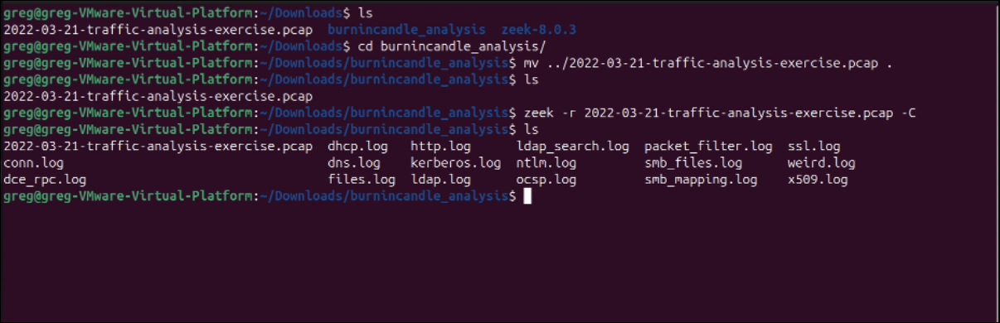

Now, the first thing I did was take a look at the conn.log. However, there's not much to really work with initially since we haven't identified anything suspicious as of now. I was looking for some suspicious domain to begin with, so I decided to open up the http.log for clues.

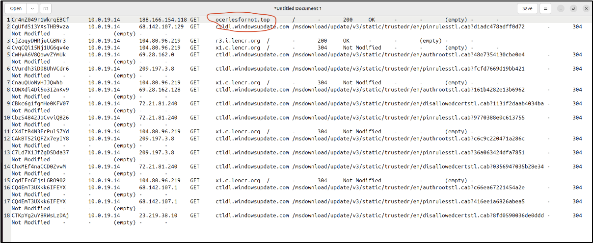

Straight away, we can see an odd-looking domain name "oceriesfornot.top". A rare .top ending lead me to investigate using VirusTotal, which confirmed my suspicions. We now have our first IOC (Indicator of Compromise).

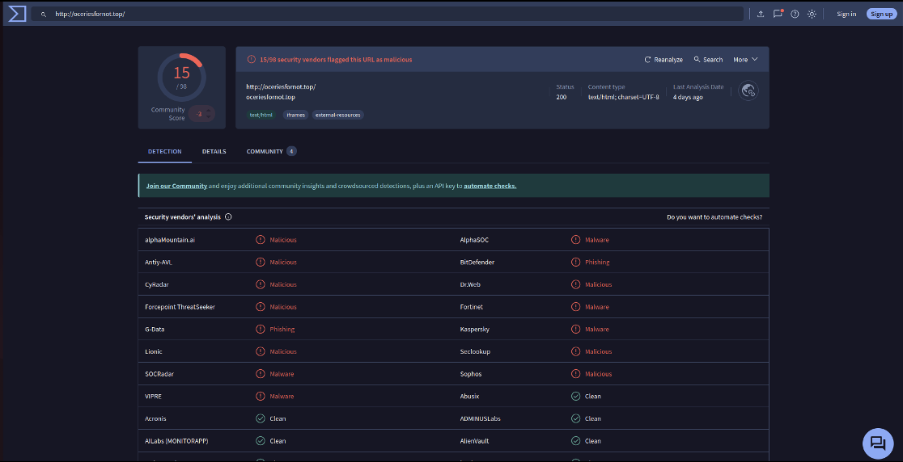

Unfortunately, that's the only mention of oceriesfornot.top in any of the files. However, investigating it's corresponding IP, I found an interesting "gzip" file.

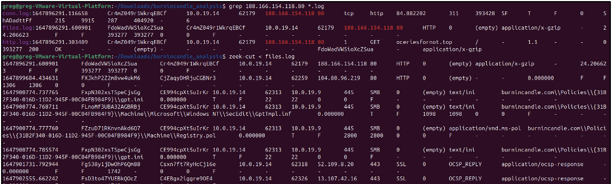

It seemed like the response to the oceries GET request came with the gzip file. I wanted to see more of this GET request response, so I booted up Wireshark to take a closer look.

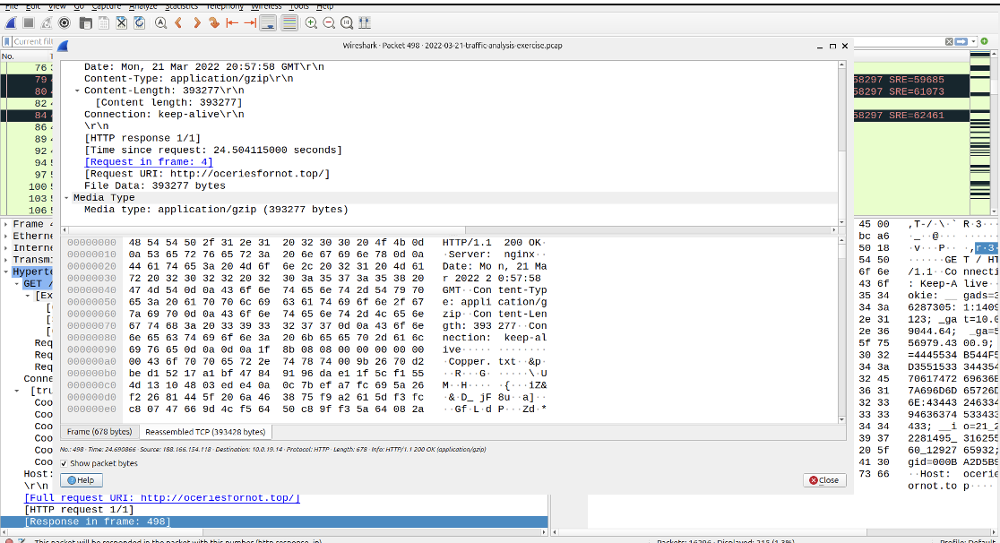

As you can see, there's a file called "Copper.txt" that was supposedly sent in the response. To view this file, I tried to extract the raw bytes and edit the headers (using a hex editor) to open Copper.txt.

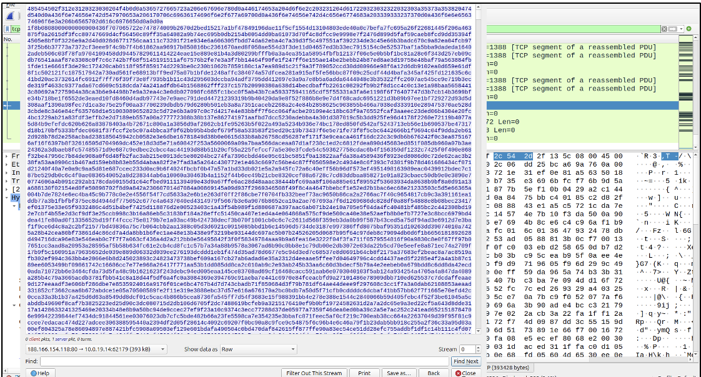

However, after much editing and attempted unzipping, I gave up on extracting the file. Turns out that the file was a decoy for the real attack which I came to realize later when I came back to this packet. For the time being, I continued looking for other suspicious domains that might've communicated with the host.

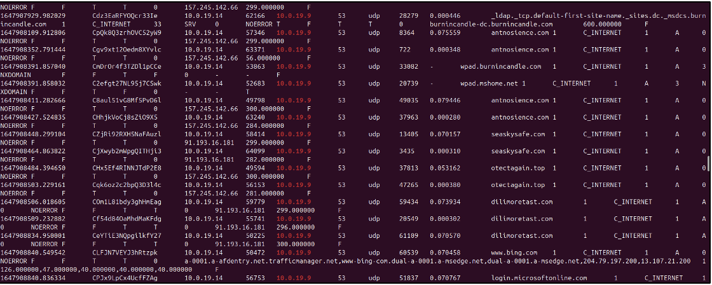

I found the domains otectagain.top from the dns.log, and once again, the .top tipped me off. VirusTotal confirmed it as malicious. Furthermore, I noted the IP for otectagain being 157.245.142.66 which was shared with some of the other domain names too.

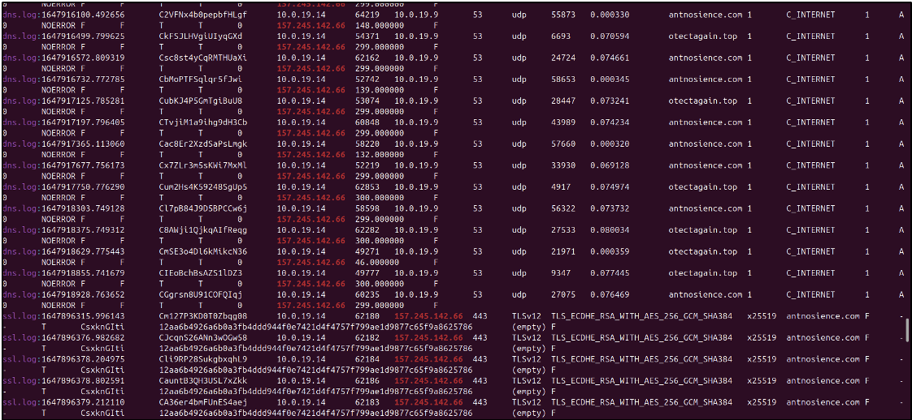

Investigating the IP, I found antnosience.com as another IOC. However, antnosience.com was more interesting as it showed up on my ssl.log as well. Had I looked into it on wireshark earlier, I would've identified the suspicious certificates signed, and found other IOCs earlier. However, I didn't realize this yet, and continued on zeek.

Luckily, I managed to find my next clue in the ssl.log, as I found an interesting anomaly with bupdater.com.

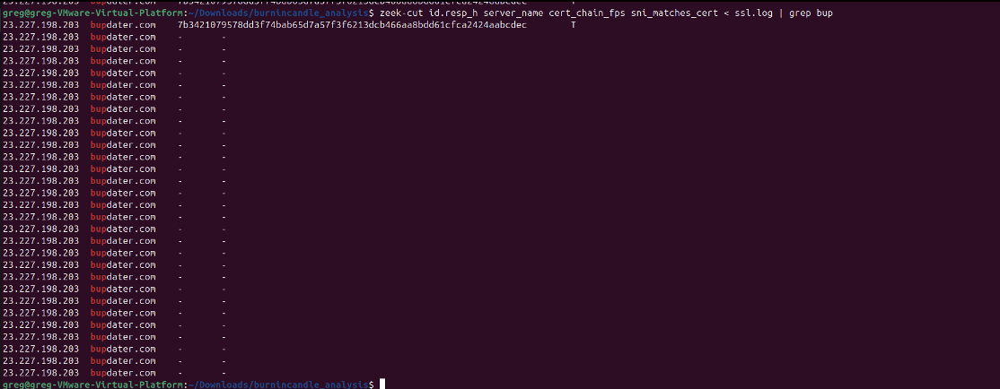

I've shown it filtered out, but unlike almost all other domains, bupdater.com did not have a cert_chain_fps on all its subsequent requests. While not suspicious itself, none of the other domains in my log had this behaviour, so I decided to investigate further.

Once again, bupdater.com turned out to be a malicious domain, but it's different from the previous IOCs I had identified. Taking a look on wireshark, initially to investigate the certificates, I found an odd pattern.

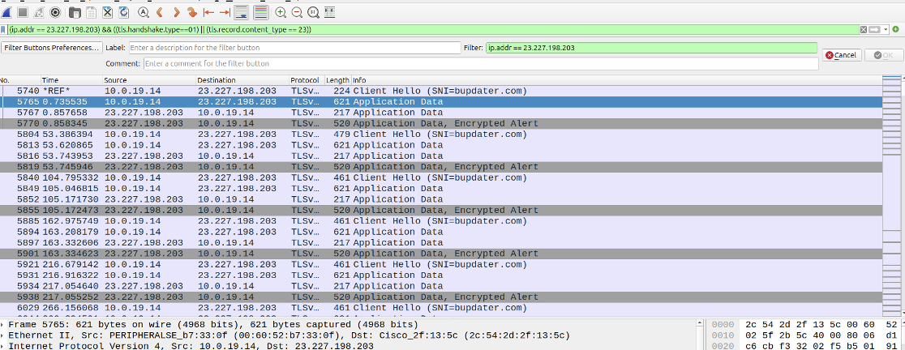

The IP above corresponds to bupdater.com, and we can see there's a clear pattern in packets sent, indicating a beacon setup. Doing a bit of research, I began to think this was a C2 (Command & Control) attack, which often uses a beacon of repeating signals. We can confirm this by looking at the timestamps, with every beacon signal spaced apart by 40-50 seconds.

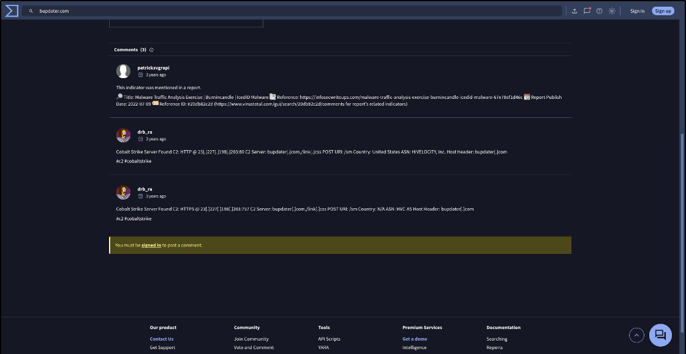

Looking back at the community section of VirusTotal on this domain, I confirmed my suspicion on the C2 attack.

However, after this I hit a dead end on any other evidence for a while. Hence, I began researching more on C2 attacks and seeing how they could be administered, which lead me to re-analyzing the oceriesfornot.top GET request, as it was the initial malicious connection.

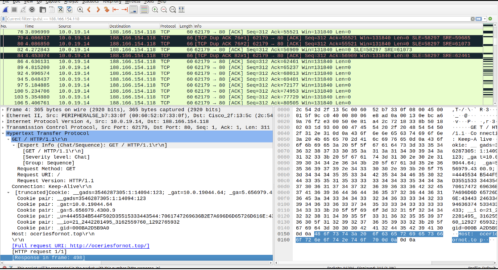

This is when I noticed the cookies included in the request, and after some research, realized the \_u one was out of place (the others being google related). Once again, more research led me to the IcedID malware attack, which perfectly confirmed my suspicions.

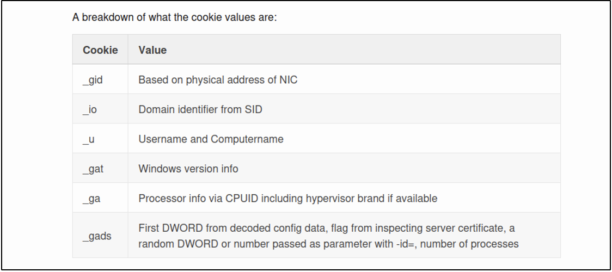

The cookie pattern for IcedID attacks perfectly matched the ones of the GET request, and I was able to confirm it was an IcedID malware. This matched with the usually MO of such malware setting up a C2 beacon on the infected host.

This also confirmed that Copper.txt was indeed not a valid file (or alteast not meant to be opened) but simply a decoy to send the cookies over.

We now have the IOC associated with the Cobalt strike C2. Just to ensure, I decided to look back on wireshark to see if any other IOCs were present, as other domains did look suspicious but I didn't want to brute force check them on VirusTotal.

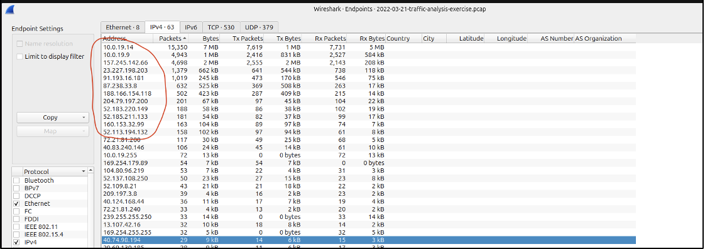

From the IPs circled above, I decided to investigate some of the domains with frequent conversations with the infected host. This led me to discover two more malicious Ips (91.193.16.181 and 160.153.32.99). This corresponded to more malicious domains: "seaskysafe.com", "dilimoretast.com", "suncoastpinball.com".

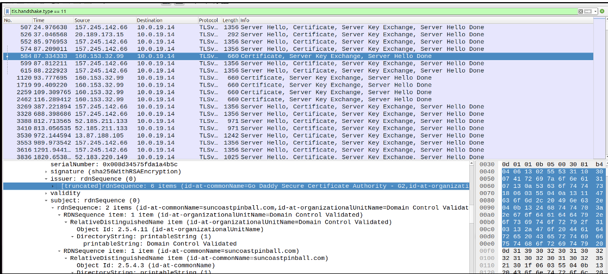

In investigating the IP for suncoastpinball.com in particular, I found a bunch of TLS handshakes in wireshark and decided to take a closer look. Importantly, I wanted to see if these sites were self-signed, and possibly if this could be a pattern with the other sites too.

As shown above however, the certificate was not self-signed, but a Go Daddy cert. Given they're very easy to get, it still indicated that the other suspicious domains might also have used shady certificates in their TLS handshakes.

Unfortunately, this is where I made the error of assuming that all the IOCs were found, as no other IPs had suspicious links. Instead of just using this as a confirmation of my current domains, I should've looked into more certs to see if any other IOCs existed.

After double checking my answers with those given in the writeup online, I realized I was missing two sites, filebin.net and situla.bitbit.net. These sites were used for file sharing without need for registration, making them perfect for delivering malicious files.

Though the writeup identified them in dns requests, I was able to find them on the ssl.log.

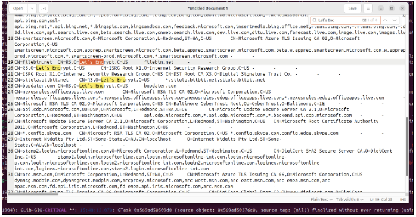

Like bupdater.com, they were signed with Let's Encrypt certs, which ticked me off, and I was able to note them down with their respective IPs.

And with that, we have found all the IOCs for this exercise! This pcap was a great exercise in zeek and wireshark, combing through logs and trying to identify suspicious activity across them. I investigated TLS handshakes, HTTP requests, DNS and SSL logs, suspicious SSL certs, and malicious cookie payloads.

Reading the writeup, it would've been far easier to identify the IcedID malware using Suricata, but I enjoyed working it out myself by investigating the cookie payload on the oceriesfornot.top response.

## Key Takeaways

* Always look into suspicious/outlier behaviour (like bupdater not having cert_chain_fps and the beacon pattern of payloads)

* Read up on attacks and how they're administered to know roughly how many IOCs you're looking for, and the purpose of each one

* Keep in mind there could be decoy behaviour like the response with the gzip file, that was used to hide the cookies instead.