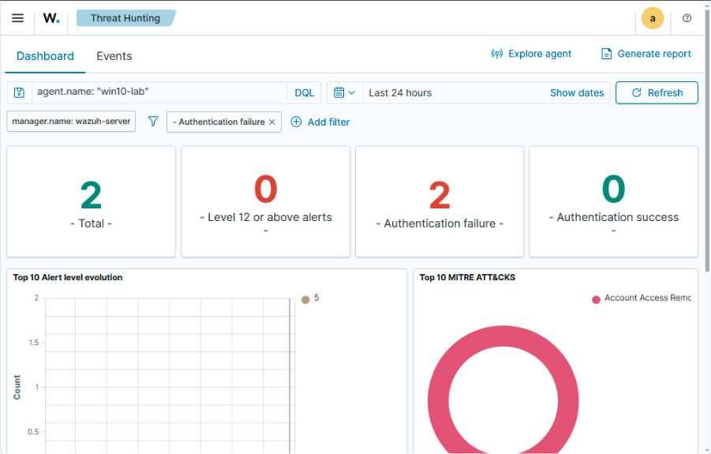
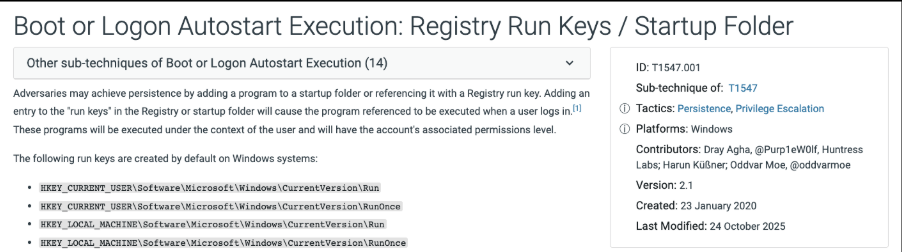
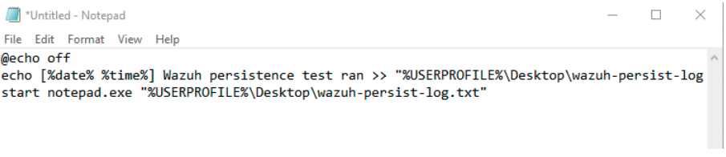
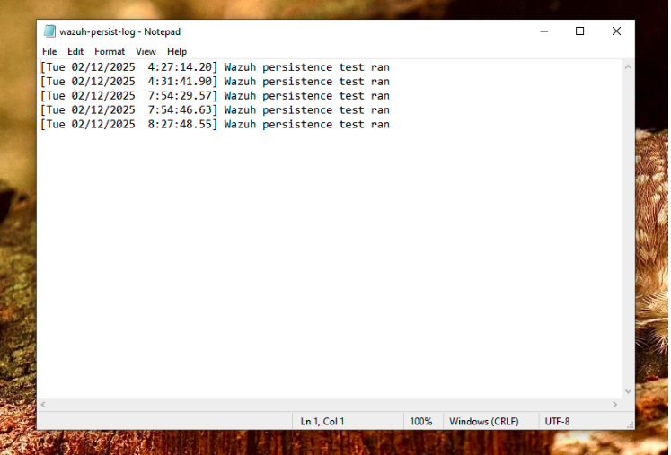
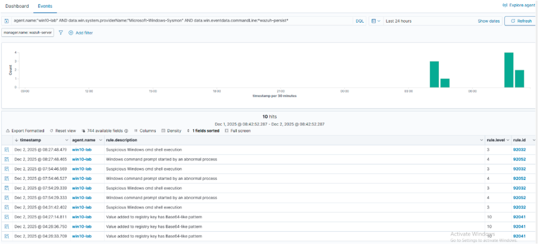
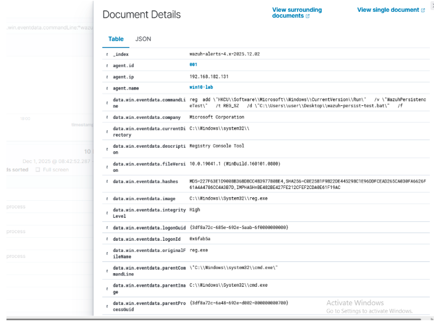
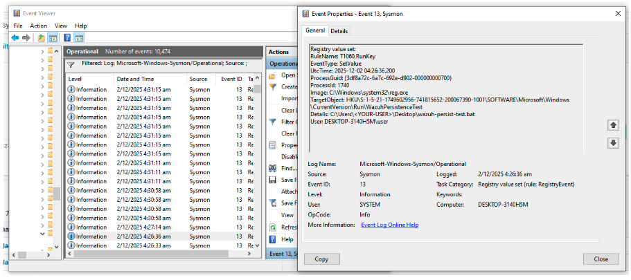

# Windows Registry Run-Key Persistence (Wazuh + Sysmon Lab)

### Introduction
This lab is a simple implementation of a registration based persistence mechanism on a Windows 10 VM, and using Wazuh + Sysmon to detect and investigate it. The main goal was to expand from network into endpoint security, while also setting up a Wazuh VM for future labs.

<br>

### Lab Environment
My host for this project was a Lenovo Thinkpad running VMWare workstation. I ran a Wazuh Server VM (hosted on ubuntu server) and an Endpoint VM (Windows 10/win10-lab) with a Wazuh agent installed and configured, along with Sysmon + SwiftOnSecurity config. Both VMs ran on a NAT network.



<br>

### Objective & Threat Model
The goal is to simulate a simple malware persistence technique using the Run registry key.

A registry key exists in the registry of a windows computer, and is run whenever the system is started. By placing malware files in the registry, or scripts to run the malware, attackers can persistently attack a victim’s computer every time it restarts. More information is available under MITRE ID T1547.001. 



The main objectives of this short project are:
* Understand how registry-based persistence works
* Understand how Sysmon logs artifacts (EID 13) and execution (EID 1)
* How to investigate such attacks and activity on Wazuh

<br>

### Attack Implementation
I began with creating a BAT script (txt file for windows cmd line) that prints “Wazuh Persistence test ran at <date,time>” to a log file, and open it on notepad.



Then, I used the following command to write the Run key value under HKCU so Windows launches the BAT file at every user logon.

```
reg add "HKCU\Software\Microsoft\Windows\CurrentVersion\Run" ^
  /v WazuhPersistenceTest ^
  /t REG_SZ ^
  /d "C:\Users\user\Desktop\wazuh-persist-test.bat" ^
  /f
```

> The command above runs in HKCU (logged in user) context

<br>

After that, all I had to do was logout and login again, and I could see the bat file opened, successfully executing a (harmless) persistence attack on my Windows VM.




Now we can move on to the detection using Wazuh and Sysmon we had installed at the Windows endpoint.
<br>

### Analysis & Reasoning 
I began by simply filtering for agent.name: “win10-lab” which simply gave me the logs for my windows VM. 

 


As shown above, we can see the “Suspicious Windows cmd shell execution” alert recently. This is the alert fired up from my last log in, which was noted down at approximately 08:27. 

Expanding the event, I could see that under the command line a “wazuh-persist” file was run. Hence, I filtered out all Sysmon alerts with “wazuh-persist” in the command line string.

> Note that the “wazuh-persist” is only because the file is named as such, not because Wazuh identified it was a persistence attack.




Running the filters, I had pretty much solved this simple attack. As shown, there are mutliple abnormal windows command prompts, followed nicely by the suspicious shell execution. This proves that the attack was a Run Key attack as it uniformly ran when I logged in, opening up the command prompt, and running the script.

At the bottom, we can see alerts related to the creation of the attack as it states “Value added to registry key”. Opening up this alert, we can view it in detail and confirm our suspicions.



Here’s where we can see the magic of Sysmon. Providing more in-depth logs of windows processes, we can view the command run on the cmd prompt earlier (reg add…) to add the malicious bat file to the registry key.

One thing to note is that under rule.groups (not shown in picture) it’s logged as sysmon_eid1_detection. However, unlike subsequent attacks, this first command which adds the bat file to the registry is actually under EID13 in Sysmon, since it’s a registry event.

We can confirm that EID13 is logged in Sysmon by opening it up under event viewer.



As we can see above, Sysmon’s detailed logs were captured when we wrote the wazuh-persist-test file to the registry. This confirms that it was indeed a Run Key Registry Persistence attack.

<br>

### Lessons Learned
Though this was a relatively simple lab, I believe it was a good launching point into endpoint security. Understanding how the Wazuh VM works (rather similar to my EFK stack SIEM) and working with windows tools like Sysmon gave me exposure to a what a real SOC analyst might use to analyze similar attacks.

Moving forward, I aim to unpack more complex malware and try to analyze it using a broader variety of tools, either built in to Wazuh or external (like Sysmon) to improve my understanding of endpoint security and common attack patterns.
